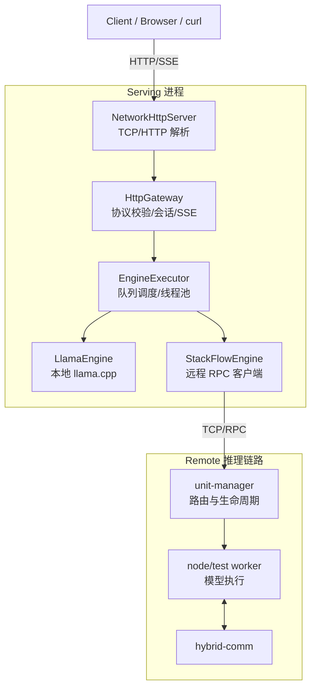

# EdgeLLM-Serving

一个轻量的 LLM Serving 系统，覆盖 **本地 llama.cpp 推理** + **StackFlow 远程推理**，提供 OpenAI 兼容的 HTTP/SSE 接口。我主要完成了 serving/gateway/engine 接入与 worker 侧改造，并打通端到端演示链路。

**项目展示点**
- OpenAI 兼容 `/v1/chat/completions`（流式 / 非流式）
- HTTP 正确解析与 SSE 推流
- 本地 / 远程双后端统一抽象
- 配置化启动与可运维脚本

**技术栈**
- C++17, nlohmann/json, glog
- llama.cpp（本地推理）
- 自研 TCP 网络层（reactor 风格）
- StackFlow RPC over TCP（远程推理）

**第三方组件说明**
- llama.cpp 作为本地模型运行时
- network、unit-manager 属于项目基础模块，我实现了 serving/gateway/engine 的整合，以及 demo worker 的功能补齐

---

**架构（分层视图）**



**目录结构（定位视图）**

```text
EdgeLLM-Serving/
├─ serving/
│  ├─ http/              # OpenAI 协议接入、SSE 输出
│  └─ core/              # ServingContext、EngineExecutor
├─ engine/               # LlamaEngine / StackFlowEngine / Factory
├─ network/              # Reactor 网络库（EventLoop/Poller/Channel）
├─ unit-manager/         # 远程调度与 worker 管理
├─ node/test/            # demo worker（远程推理执行）
├─ hybrid-comm/          # 远程通信封装
├─ scripts/              # start_all/stop_all 等脚本
└─ docs/                 # 架构、设计模式、面试问答
```

**一次请求链路**
1. `NetworkHttpServer` 按 Content-Length 组包。
2. `HttpGateway` 校验 JSON、解析参数、处理 session。
3. `EngineExecutor` 分发到本地或远程引擎。
4. `OpenAIStreamWriter` 输出 SSE 或普通 JSON。

---

**快速运行（本地 llama.cpp）**

Build:
```bash
cmake -S . -B build
cmake --build build -j
```

Run（请在仓库根目录运行，确保相对路径生效）:
```bash
./build/serving/http/serving_http_server
```

Test:
```bash
curl -s -X POST "http://127.0.0.1:8080/v1/chat/completions" \
  -H "Content-Type: application/json" \
  -d "{\"model\":\"llama\",\"messages\":[{\"role\":\"user\",\"content\":\"hello\"}]}" | jq
```

---

**远程模式（StackFlow）**

启动顺序:
1) `unit-manager`
```bash
./unit-manager/build/unit_manager
```

2) worker（`node/test`）
```bash
./node/test/build/test
```

3) HTTP server
```bash
./build/serving/http/serving_http_server
```

或者使用脚本:
```bash
bash scripts/start_all.sh
```

`start_all.sh` 会读取 `config.json`，解析相对路径为绝对路径，导出 `STACKFLOW_MODEL_PATH` / `LLAMA_MODEL_PATH` / `LLM_MODEL_PATH` / `STACKFLOW_MAX_CONCURRENCY`，并自动设置 `LD_LIBRARY_PATH`；随后清理旧 socket，将日志写到 `/tmp/llm_serving`。

---

**配置说明**

`config.json` 启动时加载，路径默认相对仓库根目录。

常用配置:
- `http_port`, `default_model`
- `llama_model_path`, `llama_n_ctx`, `llama_n_threads`, `llama_n_threads_batch`
- `default_max_tokens`, `kv_reset_margin`
- `serving_backend`（`local` 或 `stackflow`）
- `stackflow_host`, `stackflow_port`, `stackflow_unit`
- `stackflow_timeout_ms`, `stackflow_infer_timeout_ms`
- `stackflow_reuse_work_id`, `stackflow_serialize_reuse`, `stackflow_max_concurrency`

---

**代码讲解（面试版）**

**1) HTTP 解析与请求生命周期**
- 文件: `serving/http/NetworkHttpServer.cc`
- 作用: 连接级 buffer + Content-Length 组包，避免 TCP 分包导致的 JSON 解析失败。

**2) 路由与请求校验**
- 文件: `serving/http/HttpGateway.cc`
- 作用: OpenAI 格式解析、session diff、参数校验、流式回写。

**3) SSE 输出格式**
- 文件: `serving/http/OpenAIStreamWriter.cc`
- 作用: 将内部 chunk 转成 OpenAI SSE 规范，并在结束时输出 `[DONE]`。

**4) 线程与调度**
- 文件: `serving/core/EngineExecutor.cc`
- 作用: 推理任务放入 worker 线程，避免 IO 线程阻塞。

**5) 本地推理封装**
- 文件: `engine/LlamaEngine.cc`
- 作用: llama.cpp 包装，支持 max_tokens、temperature、top_p、top_k 等采样参数。

**6) 远程推理协议**
- 文件: `engine/StackFlowEngine.cc`
- 作用: TCP 交互（setup → inference → exit），支持 work_id 复用和串行保护。

**7) Worker 行为**
- 文件: `node/test/src/llm_task.cc`
- 作用: 加载模型、推理输出、UTF-8 清洗、并发控制（`try_begin_infer`）。


---

**底层模块说明（network / unit-manager / infra-controller / hybrid-comm）**

**network**
- 位置: `network/`
- 职责: TCP 事件循环、Channel/Acceptor/Buffer、连接管理，整体是 reactor 风格。
- 在本项目中: `NetworkHttpServer` 和 `StackFlowEngine` 都依赖它的非阻塞 IO。

**unit-manager**
- 位置: `unit-manager/`
- 职责: 管理 worker 生命周期、接收 RPC、维护 work_id 与通道信息。
- 在本项目中: `StackFlowEngine` 通过它完成 setup/inference/exit。

**hybrid-comm**
- 位置: `hybrid-comm/`
- 职责: ZMQ/RPC 通信封装与消息序列化，作为远程推理的数据通道。
- 在本项目中: worker 推理事件通过它回传。

**infra-controller**
- 位置: `infra-controller/`
- 职责: 进程/节点级的控制与编排（偏基础设施层）。
- 在本项目中: 目前主要作为基础模块存在，Serving 层只依赖其接口或构建产物。

---

**详细文档**

- `docs/ARCHITECTURE.md`：架构、时序图、模块调用链
- `docs/DESIGN_PATTERNS.md`：项目中使用到的设计模式与代码示例
- `docs/INTERVIEW_QA.md`：面试高频问题与回答模板

**排查与日志**
- 清理 socket:
```bash
rm -f /tmp/llm/*.sock*
```
- `start_all.sh` 日志目录: `/tmp/llm_serving`

---

**后续可提升点**
- Token batching 与调度优化
- 更完整的监控指标（QPS / 延迟 / 错误率）
- Prompt 模板与多轮角色规范化

---

**面试可讲的重点**
- 我完成了 HTTP/SSE 的工程化实现，并正确处理 TCP 分包。
- 通过统一 ServingContext 抽象接入本地与远程推理。
- 我把 IO 与推理解耦，避免阻塞事件循环。
- 我把配置、脚本与日志打包成可演示的完整项目。

---

**单元测试**

当前提供最小单元测试（不依赖模型文件），用于验证 HTTP 工具函数与参数解析逻辑。

```bash
cmake -S tests/unit -B tests/unit/build
cmake --build tests/unit/build -j
./tests/unit/build/http_utils_test
```

---

**压测数据（2026-02-23）**

`llama`（SSE，`sample/stress_sse.py`）
- 场景 A：`concurrency=6, rounds=30, abort_ratio=0`
- 结果：`total=30, ok=30, failed=0, aborted=0, avg_dur_s=15.437, avg_bytes=2691.4`
- 场景 B：`concurrency=10, rounds=80, abort_ratio=0.4`
- 结果：`total=80, ok=80, failed=0, aborted=33, avg_dur_s=15.907, avg_bytes=1606.7`

原始日志：
- `/tmp/llm_serving/bench_llama_stream_full.txt`
- `/tmp/llm_serving/bench_llama_stream_mixabort.txt`

`stackflow`（SSE，stable）
- 场景：`concurrency=2, rounds=20, abort_ratio=0`
- 结果：`total=20, ok=20, failed=0, aborted=0, avg_dur_s=2.199, avg_bytes=7439.6`
- 日志：`/tmp/llm_serving/bench_stackflow_stream_stable.txt`

