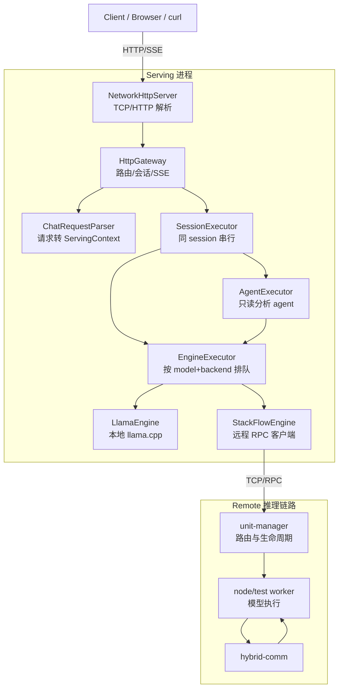

# EdgeLLM-Serving

一个轻量的 LLM Serving 系统，覆盖 **本地 llama.cpp 推理** + **StackFlow 远程推理**，提供 OpenAI 兼容的 HTTP/SSE 接口。当前代码已经支持请求级后端切换、只读分析 agent、`/v1/models` 模型发现，以及 demo 前端的 finish reason 展示与自动续写。

**项目展示点**
- OpenAI 兼容 `/v1/chat/completions`（流式 / 非流式）
- HTTP 正确解析与 SSE 推流
- 本地 / 远程双后端统一抽象
- 配置化启动与可运维脚本

**技术栈**
- C++17, nlohmann/json, glog
- llama.cpp（本地推理）
- 自研 TCP 网络层（reactor 风格）
- StackFlow RPC over TCP（远程推理）

**第三方组件说明**
- llama.cpp 作为本地模型运行时
- network、unit-manager 属于项目基础模块，我实现了 serving/gateway/engine 的整合，以及 demo worker 的功能补齐

---

**架构（分层视图）**



**目录结构（定位视图）**

```text
EdgeLLM-Serving/
├─ serving/
│  ├─ http/              # OpenAI 协议接入、SSE 输出
│  └─ core/              # session、调度、agent、ServingContext
├─ engine/               # LlamaEngine / StackFlowEngine / Factory
├─ network/              # Reactor 网络库（EventLoop/Poller/Channel）
├─ unit-manager/         # 远程调度与 worker 管理
├─ node/test/            # demo worker（远程推理执行）
├─ hybrid-comm/          # 远程通信封装
├─ scripts/              # start_all/stop_all 等脚本
└─ docs/                 # 架构、设计模式、面试问答
```

当前说明文档:
- `docs/系统架构.md`
- `docs/智能体使用说明.md`
- `docs/本地推理与RPC推理.md`
- `serving/http/使用说明.md`

**一次请求链路**
1. `NetworkHttpServer` 严格按 `Content-Length` 组包（不猜测 body 长度，不支持 `Transfer-Encoding: chunked`）。
2. `HttpGateway + ChatRequestParser` 构造 `ServingContext`。
3. `SessionExecutor` 保证同一 `session_id` 串行。
4. 普通 chat 直接进入 `EngineExecutor`；agent 请求先进入 `AgentExecutor` 再调用 `EngineExecutor`。
5. `EngineExecutor` 按 `model + inference_backend` 维度排队并复用 engine。
6. `LlamaEngine` 或 `StackFlowEngine` 执行推理。
7. `OpenAIStreamWriter` 输出 SSE，或 `HttpGateway` 输出普通 JSON。

---

**快速运行（本地 llama.cpp）**

Build:
```bash
cmake -S . -B build
cmake --build build -j
```

Run（请在仓库根目录运行，确保相对路径生效）:
```bash
./build/serving/http/serving_http_server
```

Test:
```bash
curl -s -X POST "http://127.0.0.1:8080/v1/chat/completions" \
  -H "Content-Type: application/json" \
  -d "{\"model\":\"qwen3.5-2b\",\"messages\":[{\"role\":\"user\",\"content\":\"hello\"}]}" | jq
```

流式（OpenAI 兼容写法，body 带 `"stream": true`）:
```bash
curl -sS -N -X POST "http://127.0.0.1:8080/v1/chat/completions" \
  -H "Content-Type: application/json" \
  -d "{\"model\":\"qwen3.5-2b\",\"stream\":true,\"messages\":[{\"role\":\"user\",\"content\":\"hello\"}]}"
```

列出当前可用模型:
```bash
curl -s "http://127.0.0.1:8080/v1/models" | jq
```

---

**远程模式（StackFlow）**

启动顺序:
1) `unit-manager`
```bash
./unit-manager/build/unit_manager
```

2) worker（`node/test`）
```bash
./node/test/build/test
```

3) HTTP server
```bash
./build/serving/http/serving_http_server
```

或者使用脚本:
```bash
bash scripts/start_all.sh
```

只验证 analysis agent 的真实模型工具调用链路：
```bash
bash scripts/smoke_test_analysis_agent.sh
```

如果要一键启动后端 + demo web，并自动尝试打开浏览器：
```bash
bash scripts/start_agent_demo.sh
```

`start_all.sh` 会读取 `config.json`，解析相对路径为绝对路径，导出 `STACKFLOW_MODEL_PATH` / `LLAMA_MODEL_PATH` / `LLM_MODEL_PATH` / `STACKFLOW_MAX_CONCURRENCY`，并自动设置 `LD_LIBRARY_PATH`；随后清理旧 socket，将日志写到 `/tmp/llm_serving`。

---

**配置说明**

`config.json` 启动时加载，路径默认相对仓库根目录。

推荐把请求里的 `model` 当成“逻辑模型名”，例如 `qwen3.5-2b`。  
服务端会根据 `config.json` 中的 `models` 注册表解析后端能力，再根据请求中的 `inference_backend` 决定走本地 `llama.cpp` 还是远程 `stackflow`。

示例：
- `model = qwen3.5-2b, inference_backend = local` -> 本地 `llama.cpp`
- `model = qwen3.5-2b, inference_backend = rpc` -> 远程 `stackflow`

常用配置:
- `http_port`, `default_model`
- `models`（模型注册表，按模型名解析 backend / engine / model_path）
- `llama_model_path`, `llama_n_ctx`, `llama_n_threads`, `llama_n_threads_batch`
- `default_max_tokens`, `kv_reset_margin`
- `rag_index_path`, `rag_vector_index_path`, `rag_chunk_metadata_path`
- `rag_embeddings_path`, `rag_id_map_path`
- `rag_default_top_k`, `rag_default_mode`, `rag_default_fusion`, `rag_max_context_chars`
- `rag_enable_neighbor_expand`, `rag_max_neighbor_count`, `rag_enable_retrieval_debug_api`
- `serving_backend`（`local` 或 `stackflow`）
- `stackflow_host`, `stackflow_port`, `stackflow_unit`
- `stackflow_timeout_ms`, `stackflow_infer_timeout_ms`
- `stackflow_reuse_work_id`, `stackflow_serialize_reuse`, `stackflow_max_concurrency`
- `session_persist_redis`, `redis_host`, `redis_port`, `redis_db`
- `session_redis_prefix`, `session_redis_ttl_seconds`, `redis_timeout_ms`

模型注册表示例：
```json
{
  "default_model": "qwen3.5-2b",
  "models": {
    "qwen3.5-2b": {
      "backend": "local",
      "engine": "llama",
      "model_path": "models/qwen3.5/Qwen3.5-2B-Q4_K_M.gguf"
    }
  }
}
```

这样同一个 HTTP 服务里可以按“模型 + 后端开关”切换：
- 请求 `"model":"qwen3.5-2b","inference_backend":"local"` 时走本地
- 请求 `"model":"qwen3.5-2b","inference_backend":"rpc"` 时走远程
- 如果请求里不带 `inference_backend`，则按模型注册表中的默认映射解析

说明：
- `/v1/models` 会返回当前模型注册表中的模型名
- `backends` 表示该逻辑模型在配置里的已声明后端能力（模型级）
- `gateway_backends` 表示网关支持的请求级后端切换模式（路由级）
- 前端应通过 `inference_backend` 在同一个逻辑模型上切换后端
- `stackflow` 远程模式下的 `usage` 目前是基于文本长度的近似统计，不是精确 tokenizer 结果

`inference_backend=rpc` 解析规则（当前）：
- 若模型在配置中显式声明了 rpc/stackflow 后端，则按该声明解析
- 若模型未显式声明 rpc，当前仍会走全局 `STACKFLOW_*` / `config.json` 的 stackflow fallback
- 因此 `backends` 是“模型声明能力”，`gateway_backends` 是“网关路由能力”

`-remote` 兼容策略（当前决定）：
- `config.json` 主配置不再推荐使用 `*-remote` 模型名
- `ModelRegistry` 仍暂时保留 `*-remote` 的兼容解析分支，保证历史请求不立即中断
- 后续会在一次单独迁移中移除这层兼容逻辑

**RAG v2**

当前 `POST /v1/chat/completions` 支持三种模式，且保持 v1 `mode=lexical` 兼容：
- `lexical`：沿用 SQLite FTS5
- `vector`：在线 query embedding + 离线向量索引
- `hybrid`：lexical + vector 检索后做融合，默认 `fusion=rrf`

RAG v2 额外接入了：
- `/v1/retrieval/search`：只做检索、不调模型，便于前端和调试
- Agent 工具：`search_kb`、`open_chunk`
- 流式 metadata：stream 结束前返回 references / retrieval summary
- 检索增强：exact symbol/path boost、same-file dedup、same-symbol dedup、neighbor expansion

配置项（`config.json`）：
- `rag_index_path`：SQLite lexical 索引
- `rag_vector_index_path`：向量索引清单路径，默认 `data/rag_faiss.index`
- `rag_chunk_metadata_path`：chunk metadata jsonl
- `rag_embeddings_path`：离线 embedding 矩阵
- `rag_id_map_path`：chunk id 映射
- `rag_default_top_k` / `rag_default_mode` / `rag_default_fusion`
- `rag_enable_neighbor_expand` / `rag_max_neighbor_count`
- `rag_enable_retrieval_debug_api`
- `rag_max_context_chars`

构建 lexical + vector 索引：
```bash
python3 tools/rag/build_index.py --rebuild
python3 tools/rag/build_vector_index.py --rebuild
```

只重建单个知识库也支持：
```bash
python3 tools/rag/build_index.py --kb repo_code
python3 tools/rag/build_vector_index.py --kb docs --rebuild
```

知识库仍为两个：
- `docs`：`README.md`、`docs/**/*.md`、`serving/http/使用说明.md`
- `repo_code`：`.h/.hpp/.cc/.cpp/.c/.py/.sh/.json/.md`

RAG 请求示例：
```bash
curl -s -X POST "http://127.0.0.1:8080/v1/chat/completions" \
  -H "Content-Type: application/json" \
  -d '{
    "model":"qwen3.5-2b",
    "messages":[{"role":"user","content":"references 字段是在什么地方拼出来的？"}],
    "rag":{
      "enabled":true,
      "kb":"repo_code",
      "top_k":6,
      "mode":"hybrid",
      "lexical_top_k":8,
      "vector_top_k":8,
      "fusion":"rrf",
      "debug":true,
      "return_references":true
    }
  }' | jq
```

检索调试接口：
```bash
curl -s -X POST "http://127.0.0.1:8080/v1/retrieval/search" \
  -H "Content-Type: application/json" \
  -d '{
    "kb":"repo_code",
    "query":"stream metadata references",
    "mode":"hybrid",
    "top_k":4,
    "debug":true
  }' | jq
```

Agent 可显式只开检索工具：
```bash
curl -s -X POST "http://127.0.0.1:8080/v1/chat/completions" \
  -H "Content-Type: application/json" \
  -d '{
    "model":"qwen3.5-2b",
    "agent":true,
    "tools":["search_kb","open_chunk"],
    "messages":[{"role":"user","content":"先检索知识库，说明 stream metadata references 在哪里。"}]
  }' | jq
```

非流式返回会继续携带 `references`，并在 `rag.debug=true` 时增加 `retrieval` summary。流式请求会在 `[DONE]` 前多发一个带 `metadata.references` 和 `metadata.retrieval` 的 chunk。

管理接口：
- `GET /admin/rag/status`
- `POST /admin/rag/reload-index`

评测脚本：
```bash
python3 tools/rag/eval_retrieval.py --base-url http://127.0.0.1:8080
python3 tools/rag/eval_answer.py --base-url http://127.0.0.1:8080 --model llama
```

若索引文件缺失，请求会返回明确错误，不会导致服务崩溃；`mode=lexical` 的旧请求格式仍可直接复用。

**Code Analysis Agent V1**

`agent_mode=code_analysis` 现在走稳定的 `planner + evidence + formatter` 主链路，不再只靠模型自由决定工具。它的目标不是“万能 agent”，而是“能稳定分析当前仓库代码”的只读分析能力。

当前特性：
- 支持模块职责、调用链、函数/类行为、接口/配置定位、流式链路定位、排障类问题
- 优先走 deterministic tool strategy，先检索再精读，最后输出结构化结论
- 所有证据统一映射为 `CodeEvidence`
- 非流式 debug 可直接返回 `agent_trace / evidence / agent_result`
- 新增 `POST /v1/agent/debug`，方便前端和评测脚本直接调试 planner 过程

默认工具优先级：
- `search_kb`
- `open_chunk`
- `search_code`
- `read_file`
- `list_files`
- `search_docs` / `get_config` / `get_server_status`

支持的问题类型：
- 模块职责
- 调用链 / 依赖关系
- 函数 / 类做什么
- 接口 / 配置 / 流式逻辑在哪里
- 带证据的排障问题

默认执行原则：
- 不一上来读整文件
- 先粗召回，再精读上下文
- 先拿证据，再给结论
- 没证据不下强结论
- 回答里尽量先给结论，再给分析、证据、风险和下一步

与普通 chat / RAG 的区别：
- 普通 chat 直接走模型
- RAG 是把检索结果注入 prompt
- `code_analysis` 是 agent 先多步取证，再输出结构化结论，且响应里保留 `evidence`

请求字段：
- `agent_debug`: 返回 `agent_trace`
- `agent_output_format`: `text | structured`
- `agent_include_trace`: 非 debug 模式下也可显式返回 trace
- `tools`: 可选工具白名单；如果不传，会自动填充 `code_analysis` 默认工具集
- `max_steps`: 最大 planner 步数，解析阶段会限制在 `8` 以内

structured output 示例：
```json
{
  "summary": "针对“HttpGateway 里 agent 请求是怎么进入 AgentExecutor 的”，最相关实现位于 serving/http/HttpGateway.cc:642-700。",
  "analysis": [
    "工具链：search_code -> read_file",
    "serving/http/HttpGateway.cc:642-700 展示了请求如何进入 AgentExecutor。"
  ],
  "evidence": [
    {
      "path": "serving/http/HttpGateway.cc",
      "start_line": 642,
      "end_line": 700,
      "symbol": "HttpGateway::HandleChatCompletion",
      "why_relevant": "这里展示了 agent 请求如何进入 AgentExecutor。"
    }
  ],
  "risks": [
    "如果没有继续 read_file，结论可能只停留在搜索命中。"
  ],
  "next_steps": [
    "继续围绕首个证据文件扩展上下文。"
  ]
}
```

非流式 `chat/completions` debug 返回里会额外附带：
- `agent_result`
- `evidence`
- `agent_trace`

`chat/completions` 示例：
```bash
curl -s -X POST "http://127.0.0.1:8080/v1/chat/completions" \
  -H "Content-Type: application/json" \
  -d '{
    "model":"llama",
    "agent":true,
    "agent_mode":"code_analysis",
    "agent_debug":true,
    "agent_output_format":"structured",
    "tools":["search_kb","open_chunk","search_code","read_file"],
    "messages":[
      {"role":"user","content":"HttpGateway 里 agent 请求是怎么进入 AgentExecutor 的？"}
    ]
  }' | jq
```

调试接口：
```bash
curl -s -X POST "http://127.0.0.1:8080/v1/agent/debug" \
  -H "Content-Type: application/json" \
  -d '{
    "model":"llama",
    "mode":"code_analysis",
    "debug":true,
    "query":"references 是在哪里拼出来的"
  }' | jq
```

返回里会包含：
- `planner_steps`
- `evidence`
- `final_answer`
- `content`

可直接跑的验证脚本：
```bash
bash scripts/smoke_test_agent_code_analysis.sh
python3 tools/agent/eval_code_analysis.py --base-url http://127.0.0.1:8080 --model llama
```

当前内置评测集：
- 位置：`tools/agent/eval_dataset.jsonl`
- 样例数：20
- 覆盖：`HttpGateway` / `SessionExecutor` 关系、`references` 拼装位置、`stream metadata` 输出层、`search_kb/open_chunk` 使用方式、`rag mode=hybrid` 主链路等

最新一轮小评测结果：
- `path_hit = 20/20`
- `symbol_hit = 20/20`
- `answer_term_hit = 20/20`
- `evidence_present = 20/20`

更多说明见：
- `docs/智能体使用说明.md`
- `docs/API调用示例.md`

**流式请求兼容说明**

- OpenAI 兼容方式：在 JSON body 里携带 `"stream": true`
- 兼容兜底：也接受 query `?stream=true`
- 若 body 里显式给出 `stream`，以 body 为准（覆盖 query）

**Redis 会话持久化（可选）**

用于把 `session history` 落到 Redis，支持进程重启后恢复历史上下文。

开启方式（`config.json`）:
```json
{
  "session_persist_redis": 1,
  "redis_host": "127.0.0.1",
  "redis_port": 6379,
  "redis_db": 0,
  "session_redis_prefix": "edge:session:",
  "session_redis_ttl_seconds": 1800,
  "redis_timeout_ms": 1000
}
```

行为说明:
- `SessionManager::getOrCreate` 会优先从 Redis 拉取历史并恢复。
- 请求成功结束（`stop/length`）后会写回最新历史到 Redis。
- `SessionManager::close` 会删除对应 Redis key。

---

**代码讲解（面试版）**

**1) HTTP 解析与请求生命周期**
- 文件: `serving/http/NetworkHttpServer.cc`
- 作用: 连接级 buffer + Content-Length 组包，避免 TCP 分包导致的 JSON 解析失败。

**2) 路由与请求校验**
- 文件: `serving/http/HttpGateway.cc`
- 作用: OpenAI 格式解析、session diff、参数校验、流式回写。

**3) SSE 输出格式**
- 文件: `serving/http/OpenAIStreamWriter.cc`
- 作用: 将内部 chunk 转成 OpenAI SSE 规范，并在结束时输出 `[DONE]`。

**4) 线程与调度**
- 文件: `serving/core/EngineExecutor.cc`
- 作用: 推理任务放入 worker 线程，避免 IO 线程阻塞。

**5) 本地推理封装**
- 文件: `engine/LlamaEngine.cc`
- 作用: llama.cpp 包装，支持 max_tokens、temperature、top_p、top_k 等采样参数。

**6) 远程推理协议**
- 文件: `engine/StackFlowEngine.cc`
- 作用: TCP 交互（setup → inference → exit），支持 work_id 复用和串行保护。

**7) Worker 行为**
- 文件: `node/test/src/llm_task.cc`
- 作用: 加载模型、推理输出、UTF-8 清洗、并发控制（`try_begin_infer`）。


---

**底层模块说明（network / unit-manager / infra-controller / hybrid-comm）**

**network**
- 位置: `network/`
- 职责: TCP 事件循环、Channel/Acceptor/Buffer、连接管理，整体是 reactor 风格。
- 在本项目中: `NetworkHttpServer` 和 `StackFlowEngine` 都依赖它的非阻塞 IO。

**unit-manager**
- 位置: `unit-manager/`
- 职责: 管理 worker 生命周期、接收 RPC、维护 work_id 与通道信息。
- 在本项目中: `StackFlowEngine` 通过它完成 setup/inference/exit。

**hybrid-comm**
- 位置: `hybrid-comm/`
- 职责: ZMQ/RPC 通信封装与消息序列化，作为远程推理的数据通道。
- 在本项目中: worker 推理事件通过它回传。

**infra-controller**
- 位置: `infra-controller/`
- 职责: 进程/节点级的控制与编排（偏基础设施层）。
- 在本项目中: 目前主要作为基础模块存在，Serving 层只依赖其接口或构建产物。

---

**详细文档**

- `docs/系统架构.md`：架构、时序图、模块调用链
- `docs/设计模式.md`：项目中使用到的设计模式与代码示例
- `docs/面试问答.md`：面试高频问题与回答模板
- `docs/项目亮点.md`：开场亮点与可量化结果
- `docs/技术取舍.md`：关键技术取舍与方案对比
- `docs/问题复盘.md`：真实问题复盘与修复策略
- `docs/性能压测报告.md`：压测方法、结果与吞吐估算
- `docs/API调用示例.md`：可直接复制的 API 调用示例
- `docs/可观测性与排障.md`：日志、指标与排障流程
- `docs/面试讲解稿.md`：1/3/8 分钟面试讲解稿
- `docs/本地推理与RPC推理.md`：两种推理后端的差异、优势与适用场景

**排查与日志**
- 清理 socket:
```bash
rm -f /tmp/llm/*.sock*
```
- `start_all.sh` 日志目录: `/tmp/llm_serving`

---

**后续可提升点**
- Token batching 与调度优化
- 更完整的监控指标（QPS / 延迟 / 错误率）
- Prompt 模板与多轮角色规范化

---

**面试可讲的重点**
- 我完成了 HTTP/SSE 的工程化实现，并正确处理 TCP 分包。
- 通过统一 ServingContext 抽象接入本地与远程推理。
- 我把 IO 与推理解耦，避免阻塞事件循环。
- 我把配置、脚本与日志打包成可演示的完整项目。

---

**单元测试**

当前提供最小单元测试（不依赖模型文件），用于验证 HTTP 工具函数与参数解析逻辑。

```bash
cmake -S . -B build
cmake --build build --target http_utils_test rag_test -j
./build/tests/unit/http_utils_test
./build/tests/unit/rag_test
python3 tests/unit/rag_chunkers_test.py
```

**Smoke 测试（服务自检）**

```bash
BASE_URL=http://127.0.0.1:8080 MODEL=llama bash scripts/smoke_test.sh
BASE_URL=http://127.0.0.1:8080 MODEL=llama bash scripts/smoke_test_rag.sh
BASE_URL=http://127.0.0.1:8080 MODEL=llama bash scripts/smoke_test_rag_v2.sh
```

可选参数：`BASE_URL` / `MODEL` / `TIMEOUT`。

---

**压测数据（2026-02-23）**

`llama`（SSE，`sample/stress_sse.py`）
- 场景 A：`concurrency=6, rounds=30, abort_ratio=0`
- 结果：`total=30, ok=30, failed=0, aborted=0, avg_dur_s=15.437, avg_bytes=2691.4`
- 场景 B：`concurrency=10, rounds=80, abort_ratio=0.4`
- 结果：`total=80, ok=80, failed=0, aborted=33, avg_dur_s=15.907, avg_bytes=1606.7`

原始日志：
- `/tmp/llm_serving/bench_llama_stream_full.txt`
- `/tmp/llm_serving/bench_llama_stream_mixabort.txt`

`stackflow`（SSE，stable）
- 场景：`concurrency=2, rounds=20, abort_ratio=0`
- 结果：`total=20, ok=20, failed=0, aborted=0, avg_dur_s=2.199, avg_bytes=7439.6`
- 日志：`/tmp/llm_serving/bench_stackflow_stream_stable.txt`
