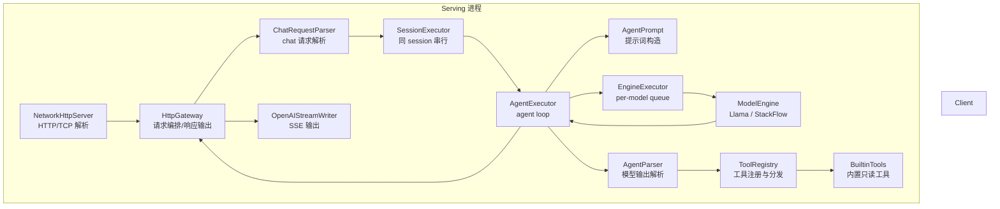
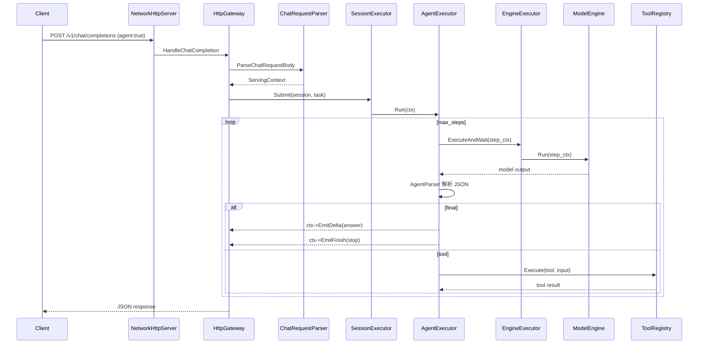

# Agent 架构说明

本文档描述 EdgeLLM-Serving 中 `agent` 能力的当前设计、模块边界、执行时序、扩展方式与约束，作为后续演进时的基线。

---

## 1. 这个 Agent 是干嘛的

先用最直白的话说：

> 这个 agent 不是一个“大而全的智能体平台”，而是一个会先查项目内信息、再回来回答用户问题的助手。

它和普通 chat 的区别是：

- 普通 chat：用户提问后，模型直接回答
- agent：用户提问后，模型先判断要不要调用工具，查到真实信息后再回答

所以它的核心作用不是“更会聊天”，而是：

- 对项目相关问题尽量不靠猜
- 对服务状态、配置、文档这类问题优先查证
- 把查到的结果整理成用户能直接读懂的回答

当前它最适合处理的问题是：

- 查服务状态
- 查配置
- 查项目文档
- 查仓库里已经明确存在的事实

例如：

- “当前服务健康吗？”
- “默认模型是什么？”
- “这个项目支不支持流式输出？”
- “session 会不会持久化到 Redis？”

当前 agent 的定位不是：

- 通用 AutoGPT
- 多 agent 编排系统
- 任意 shell 执行器
- 自动写代码或自动完成长任务的自治 agent

它当前更接近：

> EdgeLLM-Serving 的项目助手 / 运维助手 / 文档助手。

---

## 2. 这个 Agent 是怎么跑的

再用一句话概括执行方式：

> agent 在普通 chat 调用链中插入了一层 orchestration：先让模型决定“直接回答还是调工具”，如果调工具，就执行工具并把结果喂给下一轮推理，直到产出最终答案。

一次请求的大体流程是：

1. 客户端仍然请求 `/v1/chat/completions`
2. 请求体里带上 `agent: true`
3. `HttpGateway` 和 `ChatRequestParser` 解析请求、构造 `ServingContext`
4. 如果 `agent=false`，走原来的普通 chat 执行链路
5. 如果 `agent=true`，进入 `AgentExecutor`
6. `AgentExecutor` 启动一个最多 `max_steps` 轮的循环
7. 每一轮都调用底层 `EngineExecutor -> ModelEngine`
8. 模型输出两种结果之一：
   - 直接给最终答案
   - 返回一个工具调用 JSON
9. 如果是工具调用，服务端执行工具，把工具结果重新喂回下一轮
10. 如果是最终答案，结束本次请求并返回给客户端

当前内置工具只有 3 个：

- `search_docs`
- `get_config`
- `get_server_status`

所以它现在的真实执行语义是：

> “判断要不要查文档、查配置、查状态；如果要查，就查完再回答。”

模型选择说明：

- 前端或客户端可先请求 `/v1/models` 获取模型注册表
- 然后在 chat 或 agent 请求中直接传逻辑模型名
- 例如：
  - `qwen2.5-1.5b`
  - `qwen2.5-1.5b-remote`

---

## 3. 总体架构



分层理解：

- `serving/http`
  - 负责对外 HTTP/SSE 协议、请求解析、响应回写
- `serving/core/agent`
  - 负责 agent loop、模型输出解释、工具分发
- `serving/core`
  - 负责 session、调度、推理执行抽象
- `engine`
  - 负责具体模型推理

---

## 4. 目录结构

```text
serving/
├─ http/
│  ├─ NetworkHttpServer.cc      # HTTP 路由入口
│  ├─ HttpGateway.cc            # chat / stream 编排
│  ├─ ChatRequestParser.cc      # chat 请求解析与 ctx 初始化
│  └─ OpenAIStreamWriter.cc     # SSE 输出
└─ core/
   ├─ ServingContext.h          # 请求上下文
   ├─ Session.h                 # session 状态
   ├─ SessionManager.cc         # session 获取/持久化
   ├─ SessionExecutor.cc        # 同 session 串行
   ├─ EngineExecutor.cc         # engine 调度
   └─ agent/
      ├─ AgentExecutor.cc       # agent 主循环
      ├─ AgentTypes.h           # AgentAction 等结构
      ├─ AgentPrompt.cc         # prompt 与 tool result prompt
      ├─ AgentParser.cc         # 模型 JSON 输出解析
      ├─ ToolRegistry.cc        # 工具注册与执行
      └─ BuiltinTools.cc        # search_docs / get_config / get_server_status
```

---

## 5. 请求协议

agent 没有单独新开 `/v1/agents`，而是复用：

- `POST /v1/chat/completions`
- `POST /v1/chat/completions?stream=true`

新增请求字段：

```json
{
  "model": "qwen2.5-1.5b",
  "session_id": "demo-1",
  "agent": true,
  "max_steps": 4,
  "tools": ["search_docs", "get_server_status", "get_config"],
  "messages": [
    {
      "role": "user",
      "content": "当前服务状态怎么样？默认模型是什么？"
    }
  ]
}
```

字段语义：

- `model`
  - 逻辑模型名，例如 `qwen2.5-1.5b`
  - 服务端会根据模型注册表决定走本地还是远程后端
  - 例如 `qwen2.5-1.5b` 可映射到本地 `llama.cpp`，`qwen2.5-1.5b-remote` 可映射到远程 `stackflow`
- `agent`
  - `true` 时进入 agent 模式；未传或 `false` 时仍走普通 chat
- `max_steps`
  - agent 最大推理轮数；当前实现会限制上限，避免无限循环
- `tools`
  - 当前请求允许使用的工具白名单；未传则默认允许全部内置工具

---

## 6. 执行流程

### 6.1 非流式



### 6.2 流式

流式路径与非流式的主要差别不在 agent loop，而在响应输出：

- `HttpGateway` 创建 `HttpStreamSession`
- 绑定 `OpenAIStreamWriter`
- `ctx->EmitDelta(...)` 时走 SSE 回写
- `ctx->EmitFinish(...)` 时输出结束 chunk 与 `[DONE]`

当前 agent 的中间步骤不会单独暴露为结构化事件；对客户端可见的是最终 answer 的流式输出。

---

## 7. 核心模块职责

### 6.1 `ChatRequestParser`

位置：

- `serving/http/ChatRequestParser.h`
- `serving/http/ChatRequestParser.cc`

职责：

- 解析 chat 请求 JSON
- 校验 `messages`
- 读取 `agent / max_steps / tools`
- 构造 `ServingContext`
- 获取 `session`
- 将客户端全量消息与 session history 做 auto-diff

边界：

- 不负责 response 输出
- 不负责 agent loop
- 不直接执行模型

### 6.2 `HttpGateway`

位置：

- `serving/http/HttpGateway.h`
- `serving/http/HttpGateway.cc`

职责：

- 路由 chat / stream 请求
- 调用 `ChatRequestParser`
- 绑定 `on_chunk / on_finish`
- 决定走 `AgentExecutor` 还是普通 `EngineExecutor`
- 回写 JSON 或 SSE

边界：

- 不解析模型输出 JSON
- 不实现具体工具
- 不承担 agent 步进逻辑

### 6.3 `AgentExecutor`

位置：

- `serving/core/agent/AgentExecutor.h`
- `serving/core/agent/AgentExecutor.cc`

职责：

- 管理 agent step loop
- 为每一步构造 `step_ctx`
- 调用 `EngineExecutor::ExecuteAndWait`
- 解析模型输出
- 命中工具后执行工具，再组织下一轮消息
- 最终把 answer 写回外层 `ctx`

关键设计：

- agent 使用临时 `shadow_session`
- agent 内部 step 不直接污染真实 session history
- 外层请求结束后，再由 `HttpGateway` 按现有逻辑统一写回最终 history

### 6.4 `AgentPrompt`

职责：

- 构造系统 prompt
- 约束模型输出为 JSON
- 构造工具结果回灌 prompt

当前策略：

- 要求模型输出两类 JSON 之一
  - `{"action":"tool","tool":"...","input":{...}}`
  - `{"action":"final","answer":"..."}`

### 6.5 `AgentParser`

职责：

- 对模型文本输出做宽松解析
- 支持提取 fenced code block 中的 JSON
- 提取 `action/tool/input/answer`

当前约束：

- 依赖模型尽量遵守 JSON 输出协议
- 不是严格的 function calling 协议

### 6.6 `ToolRegistry`

职责：

- 维护工具名到 handler 的映射
- 对外暴露 `Register / Execute / RegisteredToolNames`

价值：

- 让 `AgentExecutor` 不需要知道具体有哪些工具
- 后续新增工具时只增注册逻辑即可

### 6.7 `BuiltinTools`

当前内置工具：

- `search_docs`
  - 检索 `README.md`、`docs/` 等文档
- `get_config`
  - 读取 `config.json`
- `get_server_status`
  - 读取由 `HttpGateway` 注入的状态 provider

约束：

- 当前都是只读工具
- 不允许任意 shell 执行
- 不允许写文件

---

## 8. Session 与 History 策略

这是后续开发最容易踩坑的部分。

### 7.1 真实 session

真实 session 由：

- `SessionManager`
- `SessionExecutor`
- `HttpGateway::on_finish`

共同维护。

语义：

- 用户层面的多轮对话历史保存在真实 session 中
- 正常结束时再写回最终 assistant answer

### 7.2 agent 内部临时 session

agent 运行时会创建一个 `shadow_session`：

- 初始 history 复制真实 session history
- 每一步内部推理都写到 shadow session
- 不直接回写真实 session

设计原因：

- 避免工具中间态污染用户可见 history
- 避免 agent 每一步都触发持久化
- 保证“用户看到的是一次完整请求的最终结果”

---

## 9. 当前实现的约束与取舍

### 8.1 为什么不做原生 function calling

当前模型后端统一走本地 `llama.cpp` / 远程 `stackflow`，并没有一个天然的 OpenAI function calling runtime。

所以第一版采用：

- prompt 约束模型输出 JSON
- 服务端解析 JSON
- 服务端执行工具

优点：

- 简单
- 可快速接入现有架构
- 不需要重写 engine 层

缺点：

- 对模型遵循度敏感
- 输出不如原生结构化调用稳定

### 8.2 为什么不直接把 agent 写进 `HttpGateway`

如果 agent loop、工具逻辑、prompt 构造、解析都放在 `HttpGateway`：

- stream / non-stream 逻辑会继续膨胀
- 模块职责会混乱
- 后续扩展工具和事件流会越来越难维护

所以 agent 独立为 `serving/core/agent/`。

### 8.3 为什么当前只做只读工具

第一版优先保证：

- 能解释
- 能验证
- 风险可控

只读工具更适合先把闭环跑通。

---

## 10. 扩展方式

### 9.1 新增一个工具

推荐流程：

1. 在 `BuiltinTools.cc` 实现 handler
2. 在 `RegisterBuiltinTools(...)` 中注册工具名
3. 在 `AgentPrompt.cc` 中补充工具说明
4. 如有必要，在文档中补充请求示例

如果工具变多，建议下一步把：

- `BuiltinTools.cc`

继续拆成：

- `DocTools.cc`
- `ConfigTools.cc`
- `OpsTools.cc`

### 9.2 新增中间事件流

如果后续要把 agent 中间过程暴露给前端，建议新增事件类型：

- `agent.step.started`
- `agent.tool.called`
- `agent.tool.result`
- `agent.answer.delta`
- `agent.finished`

但这些事件不要直接耦合到 `AgentExecutor` 的字符串输出，应抽象成独立 event writer。

### 9.3 升级为更稳的结构化调用

可演进方向：

- 约束模型输出更严格的 schema
- 引入 JSON schema 校验
- 在 engine 层增加专门的 structured decoding
- 如果后端能力允许，再兼容真正的 function calling

### 9.4 演进到多 agent

当前不建议直接上多 agent。正确顺序应是：

1. 先稳定单 agent + 工具调用
2. 再补中间事件与观测
3. 再抽 planner / worker 角色
4. 最后才考虑多 agent 协作

---

## 11. 典型请求示例

### 10.1 查询服务状态

```json
{
  "model": "llama",
  "agent": true,
  "tools": ["get_server_status"],
  "messages": [
    {
      "role": "user",
      "content": "当前服务健康状态怎么样？"
    }
  ]
}
```

### 10.2 查询配置

```json
{
  "model": "llama",
  "agent": true,
  "tools": ["get_config"],
  "messages": [
    {
      "role": "user",
      "content": "默认模型是什么？"
    }
  ]
}
```

### 10.3 查询文档

```json
{
  "model": "llama",
  "agent": true,
  "tools": ["search_docs"],
  "messages": [
    {
      "role": "user",
      "content": "这个项目支不支持流式输出？"
    }
  ]
}
```

---

## 12. 后续开发建议

如果以后继续开发 agent，建议按下面顺序推进：

1. 补自动化测试
   - parser 单测
   - tool registry 单测
   - chat request parser 单测
   - agent loop 的最小集成测试

2. 增加 agent 文档示例与 curl 样例

3. 增加 agent 中间态日志与指标

4. 考虑把 `HttpGateway` 中的 finish/history 更新逻辑再抽成独立组件

5. 最后再考虑更复杂的 tool 权限与多 agent

---

## 13. 代码定位

- 请求解析: `serving/http/ChatRequestParser.cc`
- 网关编排: `serving/http/HttpGateway.cc`
- agent 主循环: `serving/core/agent/AgentExecutor.cc`
- prompt 构造: `serving/core/agent/AgentPrompt.cc`
- 输出解析: `serving/core/agent/AgentParser.cc`
- 工具分发: `serving/core/agent/ToolRegistry.cc`
- 内置工具: `serving/core/agent/BuiltinTools.cc`
- 请求上下文: `serving/core/ServingContext.h`

这份文档的目的不是描述“理想状态”，而是准确描述当前实现和后续演进边界。
