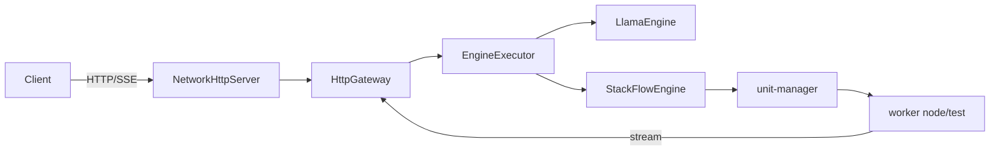

# 架构与模块详解（中文面试版）

本文档用于中文面试讲解，覆盖系统结构、模块职责、关键设计点与常见问题。

---

## 1. 系统总览

EdgeLLM-Serving 是端到端 LLM Serving 系统，支持两种后端。

- 本地推理: llama.cpp 在 serving 进程内直接推理
- 远程推理: StackFlow + unit-manager + worker 进程

两种后端共享统一的 ServingContext 与 OpenAI 兼容的 HTTP/SSE 接口。

---

## 2. 核心流程图

流程说明:
1. `NetworkHttpServer` 负责 TCP 组包与 HTTP 解析。
2. `HttpGateway` 负责参数校验、session 管理与流式回写。
3. `EngineExecutor` 负责队列调度与线程分发。
4. `LlamaEngine` 执行本地推理。
5. `StackFlowEngine` 通过 `unit-manager` 调用远程 worker。

---

## 3. 模块拆解

### 3.1 serving/http

- 位置: `serving/http/`
- 关键文件: `NetworkHttpServer.cc`, `HttpGateway.cc`, `OpenAIStreamWriter.cc`
- 责任: HTTP 解析、OpenAI 协议适配、SSE 流式输出
- 关键点: 只做协议与适配，不做推理逻辑

### 3.2 serving/core

- 位置: `serving/core/`
- 关键文件: `EngineExecutor.cc`, `ServingContext.h`
- 责任: 调度入口、队列管理、线程隔离
- 关键点: IO 线程与推理线程解耦

### 3.3 engine

- 位置: `engine/`
- 关键文件: `LlamaEngine.cc`, `StackFlowEngine.cc`
- 责任: 实际推理执行或远程推理调用
- 关键点: 两种后端统一接口，ServingContext 贯穿

### 3.4 node/test

- 位置: `node/test/`
- 关键文件: `llm_task.cc`, `llm_server.cc`
- 责任: worker 侧推理执行与 token 输出
- 关键点: UTF-8 清洗与单 worker 并发控制

### 3.5 network

- 位置: `network/`
- 责任: reactor 风格 TCP 框架
- 关键类: EventLoop, Channel, TcpServer, TcpConnection, Buffer
- 作用: HTTP Server 与 StackFlow RPC 都基于该模块

### 3.6 unit-manager

- 位置: `unit-manager/`
- 责任: worker 生命周期管理、work_id 分配、RPC 路由
- 作用: StackFlowEngine 通过它与 worker 交互

### 3.7 hybrid-comm

- 位置: `hybrid-comm/`
- 责任: RPC 与事件通道封装，ZMQ 风格传输
- 作用: worker 输出事件回传到 serving

### 3.8 infra-controller

- 位置: `infra-controller/`
- 责任: 基础设施级进程与节点编排能力
- 作用: 当前 serving 依赖较少，主要作为扩展预留

---

## 4. 关键设计点

- TCP 组包与 Content-Length 解析，避免 JSON 被拆包破坏
- SSE 规范输出，兼容 OpenAI 客户端
- IO 线程与推理线程分离，避免阻塞
- session diff，减少重复上下文传输
- StackFlow work_id 复用与串行保护，避免并发冲突
- 超时控制与错误码映射，提升可观测性

---

## 5. 配置与运维

- 配置文件: `config.json`
- 路径默认相对仓库根目录
- `scripts/start_all.sh` 会解析相对路径并导出环境变量
- 日志目录: `/tmp/llm_serving`

---

## 6. 面试讲解顺序建议

1. 从 HTTP/SSE 入口讲起，强调 TCP 分包处理
2. 说明 ServingContext 与 EngineExecutor 设计
3. 对比本地推理与远程推理的差异
4. 解释 StackFlow 的 setup/inference/exit 协议
5. 讲脚本、配置与日志如何让系统可复现

