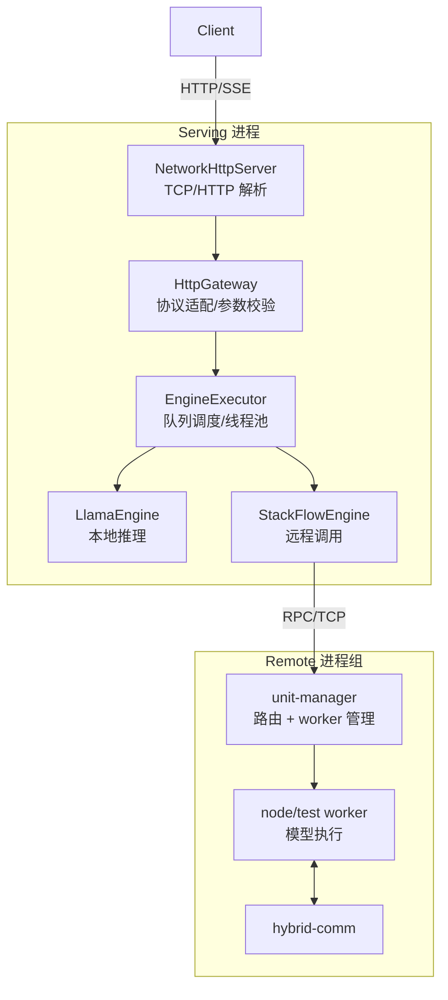
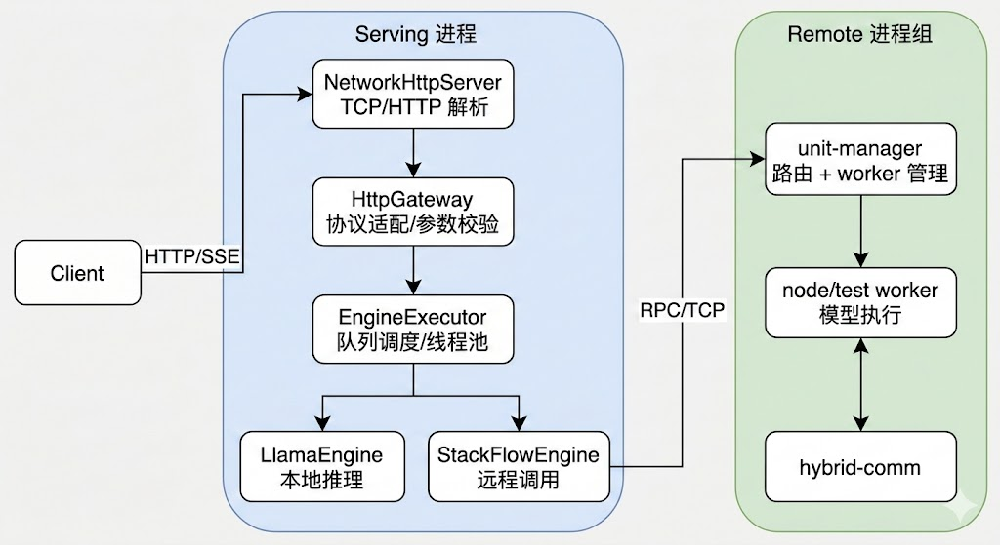
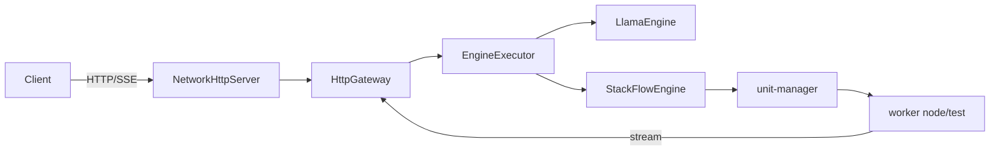
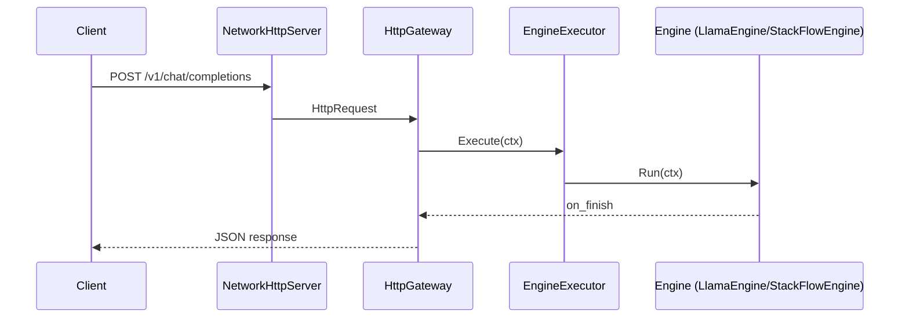
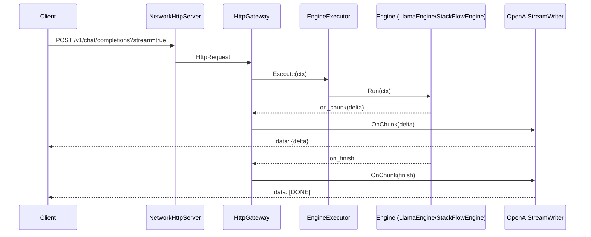
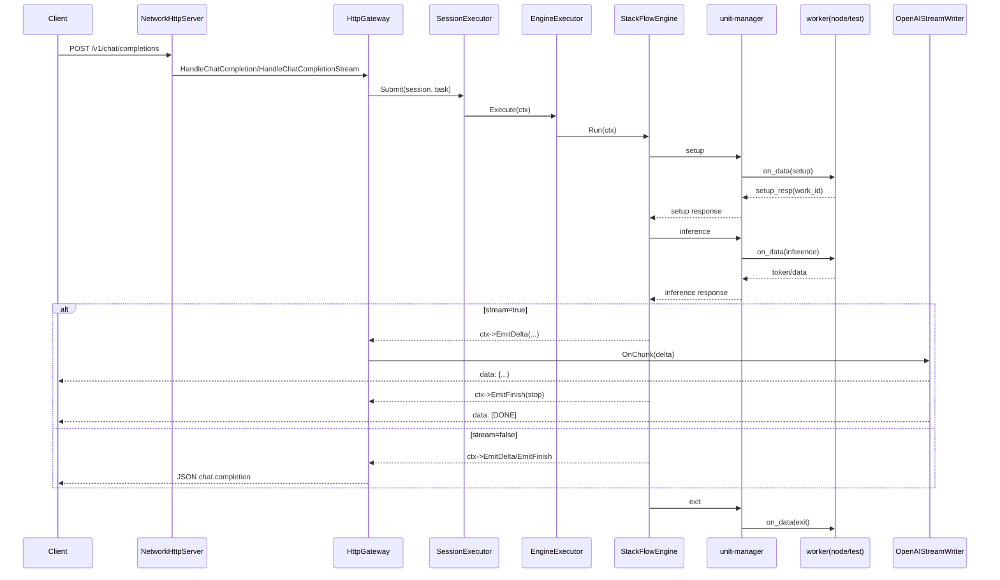
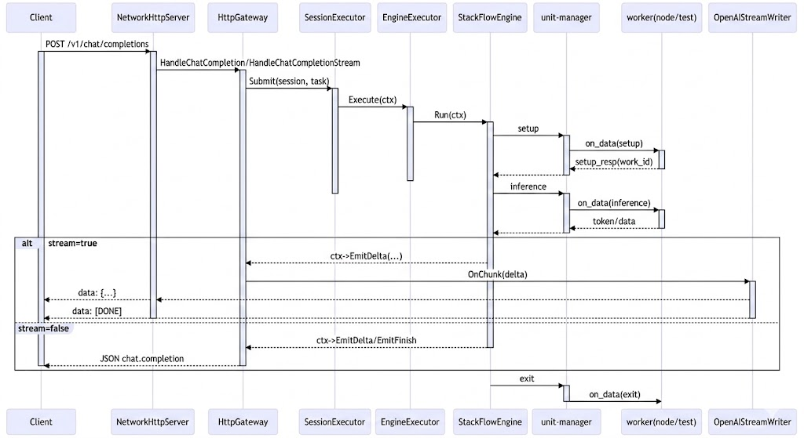

# 架构与模块详解（中文面试版·详细）

本文档用于中文面试讲解，逐模块说明职责、输入输出、关键文件与常见问题。你可以按本文档顺序完整讲清楚“我做了什么、为什么这样设计、怎么验证”。

---

## 1. 系统总览

EdgeLLM-Serving 是端到端 LLM Serving 系统，支持两种后端。

- 本地推理: llama.cpp 在 serving 进程内直接推理
- 远程推理: StackFlow + unit-manager + worker 进程

两种后端共享统一的 ServingContext 与 OpenAI 兼容的 HTTP/SSE 接口。

---

## 2. 项目结构图（清晰版）

### 2.1 分层结构图（谁调用谁）



### 2.2 目录结构图（代码在哪）

```text
EdgeLLM-Serving/
├─ serving/
│  ├─ http/
│  │  ├─ NetworkHttpServer.cc
│  │  ├─ HttpGateway.cc
│  │  └─ OpenAIStreamWriter.cc
│  └─ core/
│     ├─ ServingContext.h
│     └─ EngineExecutor.cc
├─ engine/
│  ├─ EngineFactory.cc
│  ├─ LlamaEngine.cc
│  ├─ StackFlowEngine.cc
│  └─ RpcEngine.cc
├─ network/              # Reactor: EventLoop/Poller/Channel/TcpServer
├─ unit-manager/         # 远程调度与 worker 生命周期管理
├─ node/test/            # demo worker 入口与任务执行
├─ hybrid-comm/          # RPC/ZMQ 风格消息通道
├─ scripts/              # start_all.sh / stop_all.sh
└─ docs/                 # ARCHITECTURE / DESIGN_PATTERNS / INTERVIEW_QA
```

一句话记忆:
- `serving` 负责“对外协议 + 调度”；
- `engine` 负责“推理实现”；
- `network/unit-manager/hybrid-comm/node` 负责“远程通信与执行链路”。

---

## 2.3 核心流程图



流程说明:
1. `NetworkHttpServer` 负责 TCP 组包与 HTTP 解析。
2. `HttpGateway` 负责参数校验、session 管理与流式回写。
3. `EngineExecutor` 负责队列调度与线程分发。
4. `LlamaEngine` 执行本地推理。
5. `StackFlowEngine` 通过 `unit-manager` 调用远程 worker。

---


## 2.4 时序图（非流式）



## 2.5 时序图（流式 SSE）



## 2.6 模块间调用链（关键函数）

非流式调用链:
1. `NetworkHttpServer` 组包完成后调用 `HttpGateway::HandleChatCompletion`。
2. `HttpGateway` 构造 `ServingContext` 并调用 `EngineExecutor::Execute`。
3. `EngineExecutor` 调用 `ModelEngine::Run`（本地或远程）。
4. `ModelEngine` 触发 `ctx->on_finish`，`HttpGateway` 写回 JSON 响应。

流式调用链:
1. `NetworkHttpServer` 调用 `HttpGateway::HandleChatCompletionStream`。
2. `HttpGateway` 创建 `HttpStreamSession` 与 `OpenAIStreamWriter`，绑定 `on_chunk/on_finish`。
3. `EngineExecutor` 调用 `ModelEngine::Run`，不断触发 `ctx->on_chunk`。
4. `OpenAIStreamWriter` 将 delta 转成 SSE，结束时写 `[DONE]`。

## 2.7 端到端调用时序（含函数名）



代码定位：
- `serving/http/NetworkHttpServer.cc`
- `serving/http/HttpGateway.cc`
- `serving/core/EngineExecutor.cc`
- `engine/StackFlowEngine.cc`
- `unit-manager/src/remote_server.cpp`
- `node/test/src/llm_server.cc`
- `node/test/src/llm_task.cc`

## 3. 模块详解

### 3.1 serving/http（协议接入层）

位置: `serving/http/`

职责: HTTP 解析、OpenAI 协议适配、SSE 流式输出。

输入: TCP 字节流与 HTTP 请求。

输出: OpenAI 兼容的 JSON / SSE 响应。

关键文件: `NetworkHttpServer.cc`, `HttpGateway.cc`, `OpenAIStreamWriter.cc`。

关键点: 只做协议与适配，不做推理逻辑。

常见问题: TCP 分包导致 JSON 解析失败，SSE 结束符缺失导致前端挂起。

### 3.2 serving/core（调度与上下文层）

位置: `serving/core/`

职责: 调度入口、队列管理、线程隔离、上下文定义。

输入: HttpGateway 构造的 ServingContext。

输出: 调用 engine 执行并回调 on_chunk/on_finish。

关键文件: `EngineExecutor.cc`, `ServingContext.h`。

关键点: IO 线程与推理线程解耦。

常见问题: 回调串联不当导致 non-stream 不返回；线程混用导致阻塞。

### 3.3 engine（推理后端层）

位置: `engine/`

职责: 统一推理接口，实现本地或远程推理。

输入: ServingContext（包含 messages 与采样参数）。

输出: completion 文本或 token stream。

关键文件: `LlamaEngine.cc`, `StackFlowEngine.cc`。

常见问题: 模型路径配置错误导致加载失败；超时设置过短导致远程推理中断。

### 3.4 LlamaEngine（本地推理）

职责: llama.cpp 封装，加载 GGUF，构建 prompt，推理并输出。

支持采样参数: `max_tokens`, `temperature`, `top_p`, `top_k`, `repeat_penalty`, `presence_penalty`, `frequency_penalty`, `seed`。

关键点: 本地推理最稳定，但需要本机模型与算力；需要控制 max_tokens 避免输出过长。

### 3.5 StackFlowEngine（远程推理）

职责: TCP 连接 unit-manager，执行 setup → inference → exit。

输入: 请求消息与采样参数。

输出: 远程 worker 的流式 token。

关键点: 支持 work_id 复用减少重复加载；复用时串行化防止并发冲突；超时与错误码映射提升可观测性。

### 3.6 node/test（worker 侧）

位置: `node/test/`

职责: worker 进程，加载模型并执行推理。

输入: unit-manager 的 setup/inference 命令。

输出: token stream。

关键文件: `llm_task.cc`, `llm_server.cc`。

关键点: `try_begin_infer` 防止单 worker 并发；UTF-8 清洗避免 JSON 解析错误。

### 3.7 network（底层 TCP 框架）

位置: `network/`

职责: reactor 风格 TCP 网络库。

关键类: `EventLoop`, `Channel`, `TcpServer`, `TcpConnection`, `Buffer`。

作用: HTTP Server 与 StackFlow RPC 都依赖该模块。

关键点: 非阻塞 IO + 事件循环避免阻塞。

### 3.8 unit-manager（远程调度）

位置: `unit-manager/`

职责: worker 生命周期管理、work_id 分配、RPC 路由。

输入: StackFlowEngine 的 setup/inference 请求。

输出: 连接与通道信息，转发推理请求。

关键点: 远程模式稳定性核心。

### 3.9 hybrid-comm（通信封装）

位置: `hybrid-comm/`

职责: RPC 与事件通道封装（ZMQ 风格）。

输入: worker 输出 token。

输出: 推送到 serving 的流式事件。

关键点: 远程推理的消息传输通道。

### 3.10 infra-controller（基础设施层）

位置: `infra-controller/`

职责: 基础设施级进程与节点编排能力。

作用: 当前 serving 依赖较少，作为扩展预留。

---

## 4. 配置与运维

配置文件: `config.json`。

路径默认相对仓库根目录。

`scripts/start_all.sh` 会解析相对路径并导出环境变量。

日志目录: `/tmp/llm_serving`。

常用配置:
- `http_port`, `default_model`
- `llama_model_path`, `llama_n_ctx`, `llama_n_threads`, `llama_n_threads_batch`
- `default_max_tokens`, `kv_reset_margin`
- `serving_backend`（`local` 或 `stackflow`）
- `stackflow_host`, `stackflow_port`, `stackflow_unit`
- `stackflow_timeout_ms`, `stackflow_infer_timeout_ms`
- `stackflow_reuse_work_id`, `stackflow_serialize_reuse`, `stackflow_max_concurrency`
- `session_persist_redis`, `redis_host`, `redis_port`, `redis_db`
- `session_redis_prefix`, `session_redis_ttl_seconds`, `redis_timeout_ms`

会话持久化（可选）:
- 开启 `session_persist_redis=1` 后，`SessionManager` 在 `getOrCreate` 时会尝试从 Redis 恢复历史。
- 在请求正常结束（`stop/length`）后，`HttpGateway` 会调用 `SessionManager::PersistHistory` 写回 Redis。
- key 规则：`${session_redis_prefix}${session_id}`，值为消息数组 JSON，带 TTL。

---

## 5. 常见问题与排查思路

- 请求卡住: 先看 `/tmp/llm_serving` 日志，确认 HTTP/SSE 是否有输出。
- 远程超时: 增大 `stackflow_timeout_ms`，检查 unit-manager 是否存活。
- JSON 乱码: worker 侧 UTF-8 清洗是否生效。
- SSE 断流: 检查 `OpenAIStreamWriter` 是否写入 `[DONE]`。
- 第二次请求失败: 检查 work_id 复用与串行化逻辑。

---

## 6. 面试讲解顺序建议

1. 从 HTTP/SSE 入口讲起，强调 TCP 分包处理。
2. 说明 ServingContext 与 EngineExecutor 解耦 IO 与推理。
3. 对比本地推理与远程推理的差异。
4. 解释 StackFlow 的 setup/inference/exit 协议。
5. 讲脚本、配置与日志如何让系统可复现。


---

## 7. 性能与稳定性指标（示例写法）

你可以写成你真实压测结果，格式建议如下:

- 场景: 单机 / 本地模型 / 远程模型
- 并发: 例如 10 / 50 / 100
- 结果: 平均延迟、P95、成功率

示例:
- 并发 30: 平均延迟 1.2s，P95 2.8s，成功率 99%
- 并发 50: 平均延迟 2.1s，P95 4.7s，成功率 95%

---

## 8. 故障排查手册（Runbook）

**1) HTTP 500 / internal_error**
- 看 serving 日志: `/tmp/llm_serving/serving_http.log`
- 看是否有 `engine error` 或 `setup timeout` 关键字
- 检查 `config.json` 是否正确（模型路径、backend）

**2) SSE 不结束 / 页面卡住**
- 检查 `OpenAIStreamWriter` 是否发送 `[DONE]`
- 检查 `on_finish` 是否触发
- 看 worker 是否输出了结束信号

**3) 第二次请求失败（StackFlow）**
- 检查 work_id 复用逻辑
- 检查是否启用了 `stackflow_serialize_reuse`
- 清理旧 socket: `rm -f /tmp/llm/*.sock*`

**4) 模型加载失败**
- 确认 `llama_model_path` 是否存在
- 确认启动目录是仓库根目录

---

## 9. 参数说明表（接口层）

下列参数支持从 HTTP 请求传入，并映射到 ServingContext / LlamaEngine:

- `max_tokens`: 最大生成 token 数
- `temperature`: 采样温度
- `top_p`: nucleus 采样
- `top_k`: top-k 采样
- `repeat_penalty`: 重复惩罚
- `presence_penalty`: 出现惩罚
- `frequency_penalty`: 频率惩罚
- `seed`: 随机种子

---

## 10. 关键设计决策（Why）

- **Content-Length 组包**: 避免 TCP 分包导致 JSON 解析失败
- **IO 与推理线程分离**: 防止推理阻塞事件循环
- **SSE 必须写 [DONE]**: 前端依赖结束标志释放状态
- **work_id 复用串行化**: 避免多个请求抢占同一模型上下文
