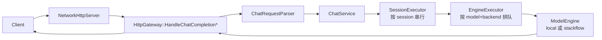

# 接口实现映射（从路由到引擎）

这份文档回答一个问题：**每个对外 HTTP 接口在代码里是怎么“落地实现”的**——从路由分发开始，经过解析/治理/后端选择，最后到本地 `llama` 或远端 `stackflow`（RPC）引擎。

> 说明：这里说的“RPC”在代码内部命名为 `stackflow`；对外 API 兼容字段常见写法是 `rpc/remote/worker/stackflow`，进入服务后会被统一归一为 `stackflow`。

## 1. 总入口与分层

- 进程入口：`serving/http/http_main.cc`
  - 从 `CONFIG_PATH`（默认 `config.json`）加载配置并写入环境变量（例如 `HTTP_PORT`、`SERVING_BACKEND`、`STACKFLOW_*` 等）
  - 可通过 `WARMUP_MODEL=0` 跳过 warmup
- HTTP 组包 + 路由：`serving/http/NetworkHttpServer.cc`
  - 负责 TCP 分包/粘包、解析 `Content-Length`、拒绝 `Transfer-Encoding: chunked`
  - 分发到 `HttpGateway` 的各个 `Handle*` 方法
- 业务网关：`serving/http/HttpGateway.cc`
  - 创建 `ChatService / EmbeddingsService / RerankService` 等业务服务
  - 统一治理（并发/超时/取消/统计）与错误映射（OpenAI 风格）

## 2. 路由表（主线）

路由分发在 `serving/http/NetworkHttpServer.cc`：

- `GET /healthz` -> `HttpGateway::HandleHealthz`（`serving/http/HealthHandler.cc`）
- `GET /v1/models` -> `HttpGateway::HandleModels`（`serving/http/ModelsHandler.cc`）
- `GET /admin/models/status` -> `HttpGateway::HandleAdminModelsStatus`（`serving/http/AdminStatusHandler.cc`）
- `GET /admin/backends/status` -> `HttpGateway::HandleAdminBackendsStatus`（`serving/http/AdminStatusHandler.cc`）
- `POST /v1/chat/completions` -> `HttpGateway::HandleChatCompletion` / `HandleChatCompletionStream`（`serving/http/HttpGateway.cc`）
- `POST /v1/embeddings` -> `HttpGateway::HandleEmbeddings`（`serving/http/EmbeddingsHandler.cc`）
- `POST /v1/rerank` -> `HttpGateway::HandleRerank`（`serving/http/RerankHandler.cc`）

兼容与实验接口也在同一处分发（见 `dispatch_compatibility_route`）。

## 3. 后端名归一（local / stackflow）

请求里的后端字段会被归一为内部命名：

- 请求字段：`inference_backend`（也兼容 `backend`）
- 归一逻辑：`serving/http/HttpGatewayInternal.cc` 的 `NormalizeBackendName()`
  - `rpc/remote/worker/stackflow` -> `stackflow`
  - `local/llama` -> `local`

随后由模型解析层决定最终后端：

- 模型目录/能力：`serving/service/ModelCatalogService.*`
- 配置解析：`engine/ModelRegistry.*`

## 4. Chat Completions（/v1/chat/completions）

Chat 的实现是**异步执行**：同 `session_id` 串行，之后按 `model + backend` 维度排队执行，并支持 SSE 流式回写。

核心链路（非流式与流式共享）：



对应关键文件：

- 请求解析：`serving/http/ChatRequestParser.cc`
- 会话串行：`serving/core/SessionExecutor.*`
- 引擎排队：`serving/core/EngineExecutor.*`
- Chat 业务编排：`serving/service/ChatService.*`
- SSE writer：`serving/http/OpenAIStreamWriter.cc`、`serving/http/HttpStreamSession.cc`

## 5. Embeddings（/v1/embeddings）

Embeddings 的实现是**同步执行**：当前不走 `SessionExecutor/EngineExecutor` 排队链路，而是：

- HTTP handler 做 JSON 解析/校验 + 治理（并发 lease / 超时 deadline / 取消 watchdog / 统计）
- Service 层做模型能力校验 + 解析最终后端 + `EngineFactory` 取/建引擎实例
- Facade 调用引擎的 embeddings 能力并返回

```mermaid
flowchart LR
  C[Client] --> N[NetworkHttpServer]
  N --> H[HttpGateway::HandleEmbeddings]
  H --> S[EmbeddingsService]
  S --> MC[ModelCatalogService<br/>HasModel / SupportsCapability / ResolveModel]
  S --> EF[EngineFactory::Create<br/>cache by model||backend]
  EF --> MR[ModelRegistry::Resolve]
  EF --> E[ModelEngine<br/>LlamaEngine/StackFlowEngine]
  S --> F[EmbeddingsEngineFacade]
  F --> E
  H --> C
```

对应关键文件：

- handler：`serving/http/EmbeddingsHandler.cc`
- 业务校验与执行：`serving/service/EmbeddingsService.cc`
- 后端选择：`serving/service/ModelCatalogService.cc`
- 引擎缓存与构建：`engine/EngineFactory.cc`
- 引擎实现：`engine/LlamaEngine.*`、`engine/StackFlowEngine.*`
- facade：`serving/backend/EmbeddingsEngineFacade.*`

治理点位置（都在 handler 侧）：

- 并发/限流：`HttpGateway::AcquireRequestLease()`（`serving/http/HttpGateway.cc`）
- 取消：`StartSyncCancelWatchdog()`（`serving/http/HttpGatewayInternal.cc`，基于 `HttpResponse::IsAlive()`）
- 超时：handler 写入 `request.deadline`，service 内部用 `BuildGovernedExecutionError()` 做统一映射

## 6. Rerank（/v1/rerank）

Rerank 与 Embeddings 的实现形态一致，也是**同步执行**，差异只在 request/response schema 与引擎能力：

- handler：`serving/http/RerankHandler.cc`
- service：`serving/service/RerankService.cc`
- facade：`serving/backend/RerankEngineFacade.*`

## 7. Models（/v1/models）与 Admin Status

### 7.1 /v1/models

实现入口：

- handler：`serving/http/ModelsHandler.cc`
- 数据来源：`serving/service/ModelCatalogService.cc` -> `engine/ModelRegistry.cc`

返回中常用字段口径：

- `declared_backends`：配置声明的后端（内部命名 `local/stackflow`）
- `backends`：网关对外展示的可用后端（对外命名 `local/rpc`）
- `gateway_backends`：网关支持的请求级切换能力（对外命名 `local/rpc`）

### 7.2 /admin/models/status 与 /admin/backends/status

实现入口：

- handler：`serving/http/AdminStatusHandler.cc`
- 组装逻辑：`serving/service/AdminStatusService.cc`

这些接口会聚合主线接口（chat/embeddings/rerank）的请求/错误/取消/超时/限流与 token 统计。

