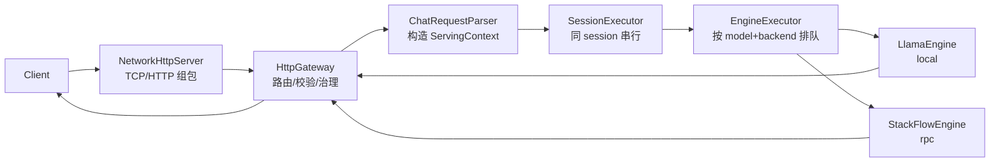

# API 接口（主线）

默认服务地址：`http://127.0.0.1:8080`

可复制的 curl 示例见：[`API调用示例.md`](API调用示例.md)。

## 0. 请求工作流程（主线心智）

这部分回答一个问题：当你调用主线 API（chat/embeddings/rerank）时，服务端内部大致按什么顺序处理，并在什么地方选本地或 RPC 后端。

### 0.1 Chat（非流式）

处理步骤（简化）：

1. `NetworkHttpServer` 按 `Content-Length` 组包，body 收齐后才进入业务层。
2. `HttpGateway` 解析 JSON、做参数校验与治理（超时/限流/排队等），并设置请求 deadline。
3. `ChatRequestParser` 把 OpenAI request 转成内部 `ServingContext`（含 `model / messages / session_id / inference_backend` 等）。
4. `SessionExecutor` 保证同一 `session_id` 的请求严格串行，避免多轮上下文并发污染。
5. `EngineExecutor` 按 `model + inference_backend` 维度排队并复用引擎实例。
6. 按后端选择执行：
   - `inference_backend=local` -> 本地 `LlamaEngine`
   - `inference_backend=rpc`（或别名 `remote/worker/stackflow`）-> 远程 `StackFlowEngine`
7. 非流式返回：等待推理结束（或连接断开/超时/取消），把 `finish_reason` 与错误码映射为响应。

### 0.2 Chat（流式 SSE）

流式与非流式的差异主要在“回包方式”：

- `HttpGateway` 会创建 `HttpStreamSession` + `OpenAIStreamWriter`
- 引擎侧通过 `ctx->EmitDelta(...)` 推 chunk，writer 输出 `data: {...}`；结束时输出 `[DONE]`
- `finish_reason`（`stop/length/cancelled/error`）会随结束帧透传

### 0.3 Embeddings / Rerank

`/v1/embeddings` 与 `/v1/rerank` 的高层流程类似：

1. HTTP 组包 -> handler 解析/校验
2. 治理：并发/超时/限流/统计（与 chat 共用口径）
3. 选择后端（local/rpc）并执行
4. 返回非流式 JSON

### 0.4 相关文档（更细）

- 更细的链路与模块职责：[`../architecture/系统架构.md`](../architecture/系统架构.md)
- 后端选择与模型注册表：[`配置说明.md`](配置说明.md)
- 错误码/metrics/admin status 口径：[`治理与错误码.md`](治理与错误码.md)
- 排障入口：[`可观测性与排障.md`](可观测性与排障.md)

## 1. 健康检查

- `GET /healthz`（主入口）
- `GET /health`（兼容别名）

## 2. 模型目录

- `GET /v1/models`

说明：

- `id` 是逻辑模型名（用于请求里的 `model`）
- `default_backend` 是配置层默认后端（内部命名：`local` / `stackflow`）
- `declared_backends` 表示该逻辑模型在配置里声明的后端能力（模型级，内部命名：`local` / `stackflow`）
- `backends` 表示该逻辑模型在网关侧可用的后端能力（对外命名：`local` / `rpc`；其中 `rpc` 会在内部归一为 `stackflow`）
- `gateway_backends` 表示网关支持的“请求级后端切换模式”（路由级，对外命名：`local` / `rpc`）；它表示**网关支持切换**，不代表配置里一定为该模型声明了对应后端

## 3. Chat Completions

- `POST /v1/chat/completions`

兼容 OpenAI 的非流式与 SSE 流式：

- 非流式：默认
- 流式：body 带 `"stream": true`（也兼容 `?stream=true`，但以 body 为准）

主线常用字段（非穷举）：

- `model`：逻辑模型名
- `messages`：OpenAI messages
- `stream`：是否 SSE
- `inference_backend`：`local` 或 `rpc`（`rpc/remote/worker/stackflow` 会归一到 stackflow）
- `session_id`：同一 session 串行执行；用于多轮上下文

错误码与治理口径见：[`治理与错误码.md`](治理与错误码.md)。

## 4. Embeddings

- `POST /v1/embeddings`

主线字段：

- `model`
- `input`

## 5. Rerank

- `POST /v1/rerank`

主线字段：

- `model`
- `query`
- `documents`
- `top_n`

## 6. Admin Status 与 Metrics

- `GET /admin/models/status`
- `GET /admin/backends/status`
- `GET /metrics`（兼容接口）

含义与字段解释见：[`治理与错误码.md`](治理与错误码.md)。

## 7. 兼容与实验接口（默认关闭）

以下接口默认关闭，需要开启环境变量：

- `POST /v1/agent/debug`（`EXPERIMENTAL_AGENT_API_ENABLED=1`）
- `POST /v1/retrieval/search`（`EXPERIMENTAL_RAG_API_ENABLED=1`）
- `GET /admin/rag/status`（`EXPERIMENTAL_RAG_API_ENABLED=1`）
- `POST /admin/rag/reload-index`（`EXPERIMENTAL_RAG_API_ENABLED=1`）

实验能力文档：

- [`../experimental/README.md`](../experimental/README.md)
