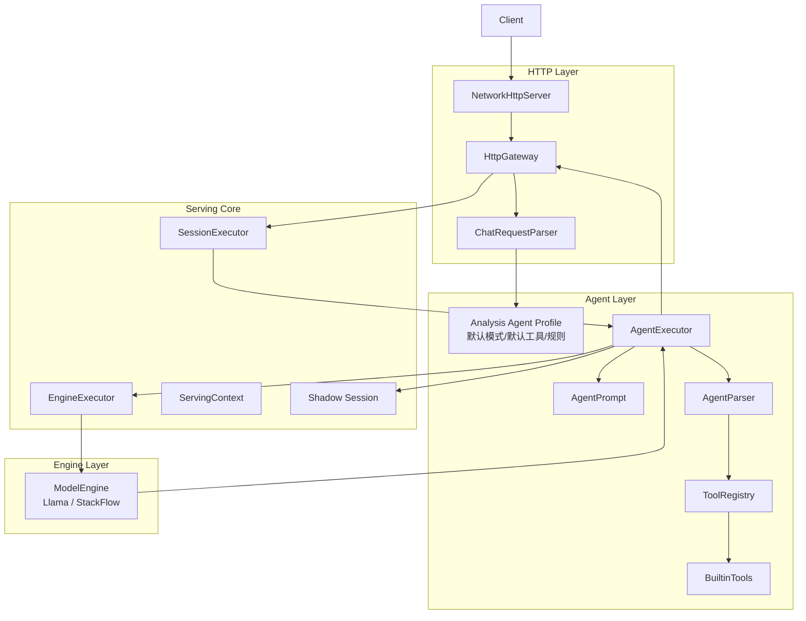
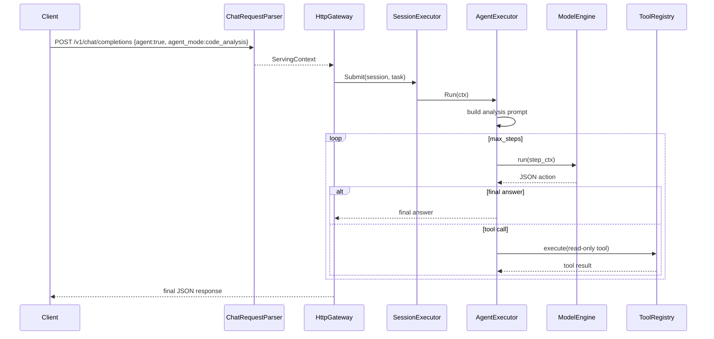

# Analysis Agent 设计说明

本文档描述 EdgeLLM-Serving 中“只读分析 agent”的目标设计、模块职责、运行链路、约束边界与后续补齐顺序。

这份文档的目的不是描述当前所有实现细节，而是给后续开发一个清晰、可执行的设计基线。

---

## 1. 设计目标

仓库中的 agent 不再定位成通用助手，而是定位成：

> 一个只读的仓库分析 agent。

它的职责是：
- 理解当前 worktree 中的代码、文档、配置和本地服务状态
- 对仓库相关问题先查证据，再回答
- 输出和仓库事实一致的分析结果
- 给出后续实现建议，但不直接执行实现

它适合处理的问题包括：
- 某个请求是怎么流转到 engine 的
- 某个配置项在哪里生效
- 某个模型名如何映射到本地或远程后端
- 某个功能应该改哪些文件
- 当前 agent 链路由哪些模块组成

---

## 2. 非目标

这个 agent 不负责：
- 写代码
- 改文件
- 删文件
- 提交或发布
- 运行任意 shell
- 调用工作区外资源
- 访问与本地服务状态无关的网络

设计上要保证它更像“分析器”，而不是“执行器”。

---

## 3. 为什么要单独做 Analysis Agent

当前项目已经有一条可用的 tool-calling agent 主链路，但如果直接把它作为通用 agent 继续扩展，会有两个问题：

1. 小模型更适合“检索 + 阅读 + 归纳”，不适合稳定地产出代码修改或复杂自治步骤。
2. 一旦 agent 具备写能力或 shell 能力，错误成本会显著上升，不适合作为默认模式。

因此更合理的策略是：

- 保留现有 agent orchestration 框架
- 把默认模式收敛到只读分析
- 用工具白名单和 prompt 约束保证行为边界

---

## 4. 对外接口设计

对外仍然复用现有 OpenAI 兼容接口：

- `POST /v1/chat/completions`
- `POST /v1/chat/completions?stream=true`

推荐请求格式：

```json
{
  "model": "qwen2.5-1.5b",
  "session_id": "analysis-demo",
  "agent": true,
  "agent_mode": "code_analysis",
  "max_steps": 4,
  "tools": [
    "search_code",
    "read_file",
    "list_files",
    "search_docs",
    "get_config",
    "get_server_status"
  ],
  "messages": [
    {
      "role": "user",
      "content": "HttpGateway 里 agent 请求是怎么进入 AgentExecutor 的？"
    }
  ]
}
```

字段语义：
- `agent`
  - 进入 agent 模式
- `agent_mode`
  - 固定使用 `code_analysis`
- `max_steps`
  - 最大推理轮数，建议默认 `4`
- `tools`
  - 当前请求允许使用的只读工具白名单

设计建议：
- 如果用户显式传了 `agent=true` 但没传 `agent_mode`，默认落到 `code_analysis`
- 如果用户没传 `tools`，默认给 Analysis Agent 的标准工具集

---

## 5. 总体架构



分层原则：
- `serving/http`
  - 只负责编排、解析和回写，不承载 agent 规则本身
- `serving/core/agent`
  - 负责 agent 推理、动作解析、工具调度和 profile 约束
- `serving/core`
  - 负责 session、排队和模型执行调度
- `engine`
  - 只负责模型运行，不承担 agent 逻辑

---

## 6. 模块职责设计

### 6.1 `ChatRequestParser`

职责：
- 解析 `agent`、`agent_mode`、`max_steps`、`tools`
- 把 agent 参数写入 `ServingContext`
- 在 request 层做基础合法性处理

目标行为：
- `agent=true` 且未传 `agent_mode` 时，默认 `code_analysis`
- `agent_mode` 只接受分析模式，其他值应回退为 `code_analysis` 或直接拒绝

涉及文件：
- `serving/http/ChatRequestParser.cc`

### 6.2 `Analysis Agent Profile`

建议新增一个轻量模块，用来集中定义 Analysis Agent 的默认行为，而不是把默认值散落在多个文件里。

职责：
- 定义默认 `agent_mode`
- 定义默认工具集合
- 定义默认 `max_steps`
- 定义只读安全边界

建议文件：
- `serving/core/agent/AgentProfile.h`
- `serving/core/agent/AgentProfile.cc`

如果不想新增模块，也至少要把这些默认值收拢到 `AgentExecutor::Options` 或 `ChatRequestParser` 中，避免重复。

### 6.3 `AgentExecutor`

职责：
- 管理 step loop
- 创建 `shadow_session`
- 调用模型
- 解析模型输出
- 执行工具
- 产出最终答案

设计要求：
- 必须接收 `ctx->agent_mode`
- 必须根据 mode 选择 prompt
- 必须根据 profile 限制允许工具
- 不能执行任何写类动作

涉及文件：
- `serving/core/agent/AgentExecutor.cc`
- `serving/core/agent/AgentExecutor.h`

### 6.4 `AgentPrompt`

职责：
- 构造分析模式 system prompt
- 把工具约束明确写进 prompt
- 把“先查证据再回答”的行为写死

设计要求：
- 明确禁止写文件、patch、shell、越界访问
- 明确要求仓库问题先调用工具
- 明确要求最终答案引用证据

涉及文件：
- `serving/core/agent/AgentPrompt.cc`
- `serving/core/agent/AgentPrompt.h`

### 6.5 `AgentParser`

职责：
- 解析模型输出的 JSON action
- 区分 `tool` 和 `final`

设计要求：
- 非法 JSON 要稳定报错
- 非法 action 要稳定报错
- 不允许出现写类 action

涉及文件：
- `serving/core/agent/AgentParser.cc`
- `serving/core/agent/AgentParser.h`

### 6.6 `ToolRegistry` 与 `BuiltinTools`

职责：
- 注册只读工具
- 根据工具名执行工具
- 保证工具调用在仓库根目录边界内

Analysis Agent 标准工具集：
- `search_code`
- `read_file`
- `list_files`
- `search_docs`
- `get_config`
- `get_server_status`

设计要求：
- 所有工具必须只读
- 工具必须限制在 repo root 内
- 工具输出必须截断，避免上下文爆炸
- 工具返回内容应尽量可引用

涉及文件：
- `serving/core/agent/ToolRegistry.cc`
- `serving/core/agent/BuiltinTools.cc`

---

## 7. 运行时序

### 7.1 非流式



### 7.2 流式

与非流式的 agent loop 一致，差别只在最终答案的输出方式：
- agent 中间步骤默认不对前端暴露
- 只把最终 answer 通过 SSE 持续写回

如果后续需要暴露中间过程，应新增独立事件层，而不是让 `AgentExecutor` 直接输出字符串事件。

---

## 8. 只读安全边界

Analysis Agent 的设计核心不是“多强”，而是“边界稳定”。

必须满足：
- 不写文件
- 不删文件
- 不 patch
- 不执行任意 shell
- 不访问 worktree 之外的路径
- 不访问无关网络
- 不在没有证据的情况下声称看过代码

安全边界由三层共同保证：

1. 文档约束
   - `agent/AGENT.md`
2. Prompt 约束
   - `AgentPrompt`
3. 工具白名单约束
   - `ToolRegistry` / `BuiltinTools`

真正可靠的是第 3 层。prompt 只能降低出错概率，不能代替工具约束。

---

## 9. 当前实现与目标设计的差距

结合当前仓库，主要差距有这些：

### 9.1 `agent_mode` 已解析，但默认模式仍偏通用

当前请求解析已经支持 `agent_mode`，但默认值仍然允许回到通用 `assistant` 模式。

目标应改成：
- 默认就是 `code_analysis`
- 其他 mode 不作为默认入口

### 9.2 `AgentPrompt` 已有分析模式，但 `AgentExecutor` 还需要确保真正按 mode 调 prompt

当前仓库里已经有 `code_analysis` prompt 文本，但后续补齐时要重点确认：
- `ctx->agent_mode` 是否完整传递到 prompt builder
- 默认路径是否真的走分析 prompt

### 9.3 文档与工具集合需要对齐

当前设计文档中部分地方仍把 agent 描述为“项目助手 / 运维助手 / 文档助手”，而代码里已经有：
- `search_code`
- `read_file`
- `list_files`

后续应统一描述成“只读分析 agent”。

### 9.4 前端默认交互仍偏 demo assistant

如果后续前端还要保留 agent 开关，建议把默认 preset 调整为：
- `Code Analysis`
- 默认工具为 6 个只读工具
- 默认提示词偏代码分析问题

---

## 10. 补齐顺序

建议按下面顺序做，而不是同时改所有模块：

1. 完成文档基线
   - 本文档
   - `agent/AGENT.md`

2. 收紧 request 默认值
   - `agent=true` 时默认 `agent_mode=code_analysis`
   - 默认工具集切到只读分析工具

3. 补齐 `AgentExecutor` 的 mode 接线
   - 保证 prompt、工具白名单、错误处理都按 analysis profile 生效

4. 补齐验证
   - 最少加一条 analysis agent 的 smoke test
   - 验证“查代码 -> 读文件 -> 给结论”这条链路

5. 最后再整理前端与现有 `docs/智能体使用说明.md`
   - 保证文档和 UI 口径一致

---

## 11. 验证标准

这个设计补齐后，至少应满足以下验收标准：

1. 当用户问仓库问题时，agent 能先调工具再回答。
2. 当用户问通用问题时，agent 可以直接回答或明确说明不属于仓库问题。
3. agent 不能请求写文件、patch 或 shell。
4. `read_file` / `list_files` / `search_code` 不能越过 repo root。
5. 最终回答里能体现出证据来源。

---

## 12. 相关文件

当前实现的关键文件：
- `agent/AGENT.md`
- `serving/http/ChatRequestParser.cc`
- `serving/http/HttpGateway.cc`
- `serving/core/agent/AgentExecutor.cc`
- `serving/core/agent/AgentPrompt.cc`
- `serving/core/agent/AgentParser.cc`
- `serving/core/agent/ToolRegistry.cc`
- `serving/core/agent/BuiltinTools.cc`

后续如果按本文档补齐，优先修改的文件也是这些。
