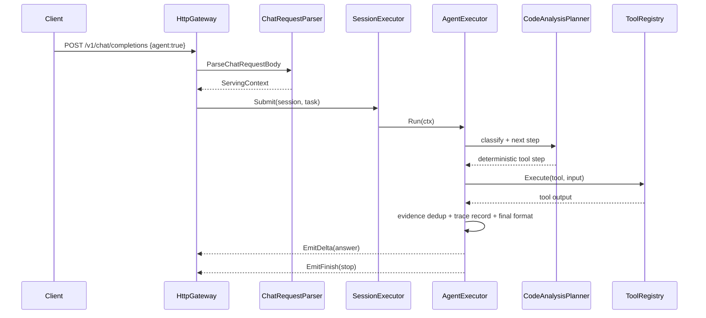

# Agent 使用说明（以当前代码为准）

本文档描述当前仓库里已经实现的 Agent 行为，重点说明 `code_analysis` 与 `web_research` 两种模式的真实能力、调用链、调试方式和限制。

## 1. 当前 agent 的定位

当前 agent 不是通用自治系统，也不是 patch agent。

它的真实定位是：

- 内嵌在 `POST /v1/chat/completions` 和 `POST /v1/agent/debug` 调用链中的只读代码分析 agent
- 默认模式是 `code_analysis`
- 优先回答仓库、代码、配置、接口、流式链路、服务状态相关问题
- 通过工具先取证，再总结
- 不支持写文件、patch 或 shell
- `web_research` 模式下支持受控外部网页搜索，但不会暴露任意 shell/curl 联网能力

一句话概括：

> 它是一个“仓库内证据优先、结构化输出优先”的只读分析 agent。

## 2. 当前支持的问题类型

`code_analysis` 当前会对用户问题做轻量分类，然后按类型选择更稳定的工具策略。`web_research` 则会先做同样的轻量分类，再由模型生成 3~5 个子查询，并为每个子查询选择 `local / web / hybrid` 数据源。

支持的问题类型：

- 模块职责类
- 调用链 / 依赖关系类
- 函数 / 类行为解释类
- 接口 / 配置 / 流式逻辑定位类
- 排障类

典型问题示例：

- `HttpGateway 和 SessionExecutor 的关系是什么`
- `HttpGateway 里 agent 请求是怎么进入 AgentExecutor 的`
- `OpenAIStreamWriter::OnChunk 做什么`
- `references 是在哪里拼出来的`
- `stream metadata 在哪一层输出`
- `rag mode=hybrid 的主链路在哪`

## 3. 接口与请求格式

### 3.1 chat/completions

普通入口仍然是：

- `POST /v1/chat/completions`
- `POST /v1/chat/completions`（body 带 `"stream": true`）

最小请求示例：

```json
{
  "model": "qwen2.5-1.5b",
  "session_id": "analysis-demo",
  "agent": true,
  "agent_mode": "web_research",
  "max_steps": 4,
  "messages": [
    {
      "role": "user",
      "content": "结合仓库和外部网页资料，说明 EdgeLLM-Serving 的 references 输出链路。"
    }
  ]
}
```

### 3.2 调试接口

当前还支持一个更适合前端和评测脚本的调试接口：

- `POST /v1/agent/debug`

它直接返回：

- `planner_steps`
- `evidence`
- `final_answer`
- `content`

示例：

```json
{
  "model": "qwen2.5-1.5b",
  "mode": "web_research",
  "debug": true,
  "query": "结合仓库和外部网页资料，说明 references 输出链路"
}
```

## 4. 请求字段语义

- `agent`
  为 `true` 时进入 agent 流程；否则走普通 chat。

- `agent_mode`
  当前支持：
  - `code_analysis`
  - `web_research`

  未传时默认仍是 `code_analysis`。

- `max_steps`
  最大 agent 轮数，解析阶段会限制到 `8` 以内。

- `tools`
  当前请求允许使用的工具白名单；如果不传，服务端会按 `agent_mode` 自动填默认工具集。

- `agent_debug`
  非流式返回时增加 `agent_trace`。

- `agent_output_format`
  当前支持：
  - `text`
  - `structured`

- `agent_include_trace`
  非 debug 模式下也可以强制返回 `agent_trace`。

- `inference_backend`
  仍然可以正常工作。agent 只是上层编排，不改变底层本地或 RPC 推理后端。

## 5. 当前内置工具

当前 `code_analysis` 默认工具集是：

- `search_kb`
- `open_chunk`
- `search_code`
- `read_file`
- `list_files`
- `search_docs`
- `get_config`
- `get_server_status`

当前 `web_research` 默认工具集是：

- `search_kb`
- `open_chunk`
- `search_code`
- `read_file`
- `list_files`
- `search_docs`
- `search_web`
- `fetch_url`
- `get_config`
- `get_server_status`

它们注册在：

- `serving/core/agent/BuiltinTools.cc`
- `serving/core/agent/ToolRegistry.cc`

## 6. Code Analysis Agent 的执行原则

当前实现遵循以下原则：

- 不一上来读整文件
- 先粗召回，再精读
- 先拿证据，再总结
- 没证据不下强结论
- 允许 planner 注入 deterministic step
- 模型不负责底层工具策略，只负责最后总结
- `web_research` 先拆分子查询，再按 repo/docs/web 选受控工具

## 7. 主执行链路

### 7.1 chat/completions 主链路



`web_research` 在 `AgentExecutor` 里复用了同一套 trace / evidence / formatter 收口，但链路改成了“轻量分类 -> 模型做 query decomposition -> 工具层 deterministic 执行 -> 模型基于 evidence 做 final synthesis”。

### 7.2 /v1/agent/debug 主链路

`/v1/agent/debug` 不走 OpenAI 风格包装，而是直接返回 planner/evidence/final answer，便于调试和评测。

## 8. 问题分类与工具策略

当前分类和工具策略主要放在：

- `serving/core/agent/code_analysis/CodeAnalysisHeuristics.cc`
- `serving/core/agent/code_analysis/CodeAnalysisPlanner.cc`

典型规则：

- 如果问题里出现明确 symbol 或文件名：
  优先 `search_code`

- 如果是调用链 / 依赖关系类问题：
  优先 `search_code`，再 `read_file`

- 如果 `search_kb` 命中 chunk：
  下一步优先 `open_chunk`

- 如果是接口 / 配置 / 流式定位类问题：
  根据关键词优先 `search_docs`、`search_code` 或 `get_config`

- 如果证据不足：
  planner 会做 deterministic fallback，而不是让模型空想

`web_research` 的额外策略：

- 先做轻量分类，再让模型只输出 3~5 个子查询和 `local / web / hybrid` 来源
- 工具层根据子查询 deterministic 执行 `search_kb / open_chunk / search_web / fetch_url`，必要时回退 `search_code / read_file`
- 模型不直接决定底层联网细节，也不会拿到 shell / curl 能力
- 分页、超时、去重、域名约束、正文抽取仍留在工具层
- 最终仍统一回收成 `CodeEvidence` 和结构化结果

## 9. 证据模型

当前所有工具结果最后都会尽量映射成统一证据结构 `CodeEvidence`。

字段包括：

- `source_type`
- `reference_source`
- `chunk_id`
- `path`
- `title`
- `url`
- `start_line`
- `end_line`
- `symbol`
- `snippet`
- `why_relevant`
- `score`

相关代码：

- `serving/core/agent/code_analysis/CodeAnalysisTypes.h`
- `serving/core/agent/code_analysis/CodeAnalysisEvidence.cc`

证据去重当前支持：

- 同 `path + line range`
- 同 `symbol`
- 同 `chunk_id`
- 同 `url`

## 10. 结构化输出

当前 final answer 会被收敛成结构化结果，字段包括：

- `summary`
- `analysis`
- `evidence`
- `risks`
- `next_steps`

示例：

```json
{
  "summary": "针对“references 是在哪里拼出来的”，最相关实现位于 serving/http/HttpGateway.cc:958。",
  "analysis": [
    "工具链：search_code -> read_file",
    "serving/http/HttpGateway.cc:958 展示了 references 在非流式响应里如何拼装。"
  ],
  "evidence": [
    {
      "path": "serving/http/HttpGateway.cc",
      "start_line": 958,
      "end_line": 958,
      "symbol": "build_rag_references",
      "why_relevant": "这里给出了用户要找的位置或文件。"
    }
  ],
  "risks": [],
  "next_steps": [
    "如需继续确认流式路径，可再查看 OpenAIStreamWriter::OnChunk。"
  ]
}
```

### 10.1 chat/completions 非流式返回

如果开启 debug，非流式响应除了 OpenAI 风格 `choices` 外，还会附带：

- `agent_result`
- `evidence`
- `agent_trace`
- `references`

### 10.2 /v1/agent/debug 返回

当前主要字段：

- `planner_steps`
- `evidence`
- `final_answer`
- `content`
- `references`

## 11. Trace 与调试信息

当前 trace 会记录：

- `step_index`
- `selected_tool`
- `tool_input`
- `tool_output_summary`
- `evidence_count`
- `planner_reason`

相关代码：

- `serving/core/ServingContext.h`
- `serving/http/HttpGateway.cc`

当前流式模式默认不会把每一步 trace 作为独立 SSE 事件往前端推；这是后续可以继续扩展的方向。

## 12. 与普通 chat / RAG 的区别

- 普通 chat：
  直接走模型推理，不做显式工具编排

- RAG：
  把检索上下文注入 prompt，本质仍是一轮模型回答

- `code_analysis`：
  先走 planner 决定工具，再收集统一证据，最后输出结构化结论

- `web_research`：
  先由模型拆子查询，再由工具层混合 repo/docs/web 证据，最后由模型基于 evidence 输出结构化结论与 `references`

## 13. 当前实现的关键模块

- 请求解析：
  `serving/http/ChatRequestParser.cc`

- Agent 主入口：
  `serving/core/agent/AgentExecutor.cc`

- 问题分类与 query/path heuristic：
  `serving/core/agent/code_analysis/CodeAnalysisHeuristics.cc`

- planner：
  `serving/core/agent/code_analysis/CodeAnalysisPlanner.cc`

- evidence：
  `serving/core/agent/code_analysis/CodeAnalysisEvidence.cc`

- formatter：
  `serving/core/agent/code_analysis/CodeAnalysisFormatter.cc`

- HTTP 响应挂载：
  `serving/http/HttpGateway.cc`

## 14. 评测与验证

### 14.1 smoke test

```bash
bash scripts/smoke_test_agent_code_analysis.sh
```

当前覆盖：

- `search_kb -> open_chunk`
- `search_code -> read_file`
- `structured output`
- `debug trace`

### 14.2 小评测集

```bash
python3 tools/agent/eval_code_analysis.py --base-url http://127.0.0.1:8080 --model llama
```

评测集位置：

- `tools/agent/eval_dataset.jsonl`

当前样例数：

- 20 条

覆盖方向：

- `HttpGateway` / `SessionExecutor` 关系
- `references` 拼装位置
- `stream metadata` 输出层
- `search_kb / open_chunk` 的 agent 使用方式
- `rag mode=hybrid` 主链路
- `agent_trace` / `evidence` / `default_tools_for_mode` 定位

最近一轮结果：

- `path_hit = 20/20`
- `symbol_hit = 20/20`
- `answer_term_hit = 20/20`
- `evidence_present = 20/20`

## 15. 示例返回

`web_research` 非流式返回会额外带 `references`，来源区分 `repo_code / docs / web`。简化示例如下：

```json
{
  "choices": [
    {
      "message": {
        "role": "assistant",
        "content": "{\n  \"summary\": \"...\"\n}"
      }
    }
  ],
  "agent_result": {
    "summary": "针对“references 输出链路”，已汇总本地仓库与外部网页证据。",
    "references": [
      {
        "source": "repo_code",
        "path": "serving/http/HttpGateway.cc",
        "start_line": 956,
        "end_line": 958
      },
      {
        "source": "web",
        "title": "OpenAI API Platform",
        "url": "https://openai.com/api/"
      }
    ]
  },
  "references": [
    {
      "source": "repo_code",
      "path": "serving/http/HttpGateway.cc",
      "start_line": 956,
      "end_line": 958
    },
    {
      "source": "web",
      "title": "OpenAI API Platform",
      "url": "https://openai.com/api/"
    }
  ]
}
```

## 16. 当前限制

以下能力当前没有：

- 写文件工具
- patch 工具
- shell 工具
- 多 agent 协作
- 流式 trace event

`web_research` 虽然支持外部网页搜索，但当前仍有这些约束：

- 只暴露 `search_web` / `fetch_url`
- 只允许受控 `http/https` 页面抓取
- 默认拦截本地地址、私网地址和非常规端口
- 网页正文抽取是最小实现，复杂站点可能只拿到部分正文

因此当前最准确的说法是：

> 它是一个只读、证据优先、统一结构化输出的研究 agent；其中 `code_analysis` 偏仓库分析，`web_research` 偏“仓库 + 外网”混合研究。
