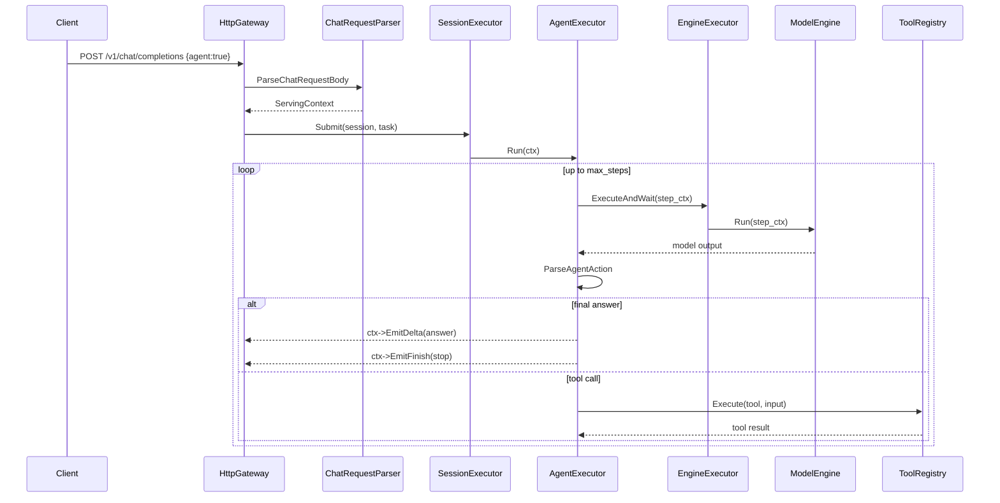

# Agent 使用说明（以当前代码为准）

本文档描述仓库里当前已经实现的 agent 行为，不讨论历史设想或未来目标。

## 1. 当前 agent 是什么

当前 agent 不是通用自治系统，而是一个内嵌在 `/v1/chat/completions` 调用链中的只读分析 agent。

它的真实定位是：

- 默认模式是 `code_analysis`
- 优先回答仓库、代码、配置、文档、服务状态相关问题
- 通过工具先查证，再回答
- 不支持写文件、patch、shell 或外部执行

## 2. 入口与请求格式

agent 没有单独的新接口，仍然走：

- `POST /v1/chat/completions`
- `POST /v1/chat/completions?stream=true`

最小请求示例：

```json
{
  "model": "qwen3.5-2b",
  "session_id": "analysis-demo",
  "agent": true,
  "agent_mode": "code_analysis",
  "max_steps": 4,
  "tools": [
    "search_code",
    "read_file",
    "list_files",
    "search_docs",
    "get_config",
    "get_server_status"
  ],
  "messages": [
    {
      "role": "user",
      "content": "HttpGateway 里 agent 请求是怎么进入 AgentExecutor 的？"
    }
  ]
}
```

## 3. 当前字段语义

- `agent`
  为 `true` 时进入 agent 流程；否则走普通 chat。
- `agent_mode`
  当前仅支持 `code_analysis`。未传时默认也是 `code_analysis`。
- `max_steps`
  最大 agent 轮数，解析阶段会限制到 `8` 以内。
- `tools`
  当前请求允许使用的工具白名单；如果不传，服务端会为 `code_analysis` 填默认工具集。
- `inference_backend`
  仍然可以正常工作，agent 只是上层编排，不改变底层本地或 RPC 推理后端。

## 4. 当前内置工具

当前内置只读工具共有 6 个：

- `search_code`
- `read_file`
- `list_files`
- `search_docs`
- `get_config`
- `get_server_status`

它们注册在：

- `serving/core/agent/BuiltinTools.cc`
- `serving/core/agent/ToolRegistry.cc`

## 5. 主执行链路



## 6. 当前实现的关键规则

### 6.1 默认模式就是 `code_analysis`

请求解析在 `serving/http/ChatRequestParser.cc` 中完成。当前实现会把下面这些值都收敛为 `code_analysis`：

- 空值
- `assistant`
- `code`
- `code_agent`
- 其他未知值

### 6.2 仓库问题必须先调工具

`BuildToolPrompt()` 和 `AgentExecutor::Run()` 共同约束了这件事：

- 如果是仓库、代码、配置、文档、架构、模型、API 相关问题，必须先调工具
- 如果模型试图不经工具直接回答仓库问题，executor 会把它拉回去再问一次

### 6.3 默认工具集是代码分析导向

`code_analysis` 当前默认工具集是：

```text
search_code, read_file, list_files, search_docs, get_config, get_server_status
```

### 6.4 `search_code` 命中后会自动补一段 `read_file`

这是当前实现里的重要增强：

- 当工具调用是 `search_code`
- 且解析出首个命中文件和行号
- executor 会自动再读该位置上下文
- 再把这段上下文拼到同一次工具结果后面

这样模型不用每次显式再发一轮 `read_file` 才能看局部代码。

### 6.5 每个 step 的 `max_tokens` 有下限

当前 `AgentExecutor` 会把每一步的 `max_tokens` 至少抬到 `384`，避免 agent step 因 token 太小而频繁输出半截 JSON。

### 6.6 中间步骤不直接暴露给前端

无论是否流式：

- 当前前端看不到结构化的 `tool.called` 或 `tool.result` 事件
- 客户端可见的是最终答案的流式或非流式输出

## 7. `shadow_session` 的真实用途

agent 内部不会直接在真实 session 上逐步追加每一轮推理，而是使用一个临时的 `shadow_session`。

这么做的目的：

- 保留 agent 多轮推理的上下文连续性
- 避免 agent 每一步都污染真实会话历史
- 避免每一步都触发持久化

最终只有本次请求的最终用户消息和最终 assistant 回答会进入真实 session。

## 8. 输出解析器当前能处理什么

`serving/core/agent/AgentParser.cc` 当前已做几层容错：

- 去掉 `<think> ... </think>`
- 去掉外围代码块围栏
- 截取首尾 JSON 对象
- 容忍宽松的 `"answer":"..."` 字段提取
- 如果 `answer` 是数组，会拼成多行字符串

这使得 agent 对模型输出格式漂移更稳一点。

## 9. 流式与非流式差异

差异主要不在 agent loop，而在最终答案怎么回给客户端。

### 9.1 非流式

- `AgentExecutor` 在最终 answer 时调用 `ctx->EmitDelta(answer)`
- 然后 `ctx->EmitFinish(stop)`
- `HttpGateway` 最终写标准 `chat.completion` JSON

### 9.2 流式

- `HttpGateway` 预先绑定 `OpenAIStreamWriter`
- 最终 answer 被转换成 SSE chunk
- 结束时输出 finish chunk 和 `[DONE]`

agent 中间步骤默认仍然不单独流出。

## 10. 当前限制

以下能力当前没有：

- 写文件工具
- patch 工具
- shell 工具
- 外部网络搜索
- 多 agent 协作
- 结构化中间态事件输出

因此当前最准确的说法是：

> 它是一个只读、仓库内证据优先的分析 agent，而不是通用任务执行 agent。

## 11. 与 demo 前端的关系

demo 页面中的 `Enable Agent` 开关只是把这些参数发到 `/v1/chat/completions`：

- `agent`
- `agent_mode`
- `max_steps`
- `tools`

前端本身不执行工具，也不理解 agent 中间态；所有 agent 逻辑都在服务端。

## 12. 关键代码定位

- 请求解析：`serving/http/ChatRequestParser.cc`
- agent 主循环：`serving/core/agent/AgentExecutor.cc`
- prompt 构造：`serving/core/agent/AgentPrompt.cc`
- 输出解析：`serving/core/agent/AgentParser.cc`
- 工具注册：`serving/core/agent/ToolRegistry.cc`
- 内置工具：`serving/core/agent/BuiltinTools.cc`
