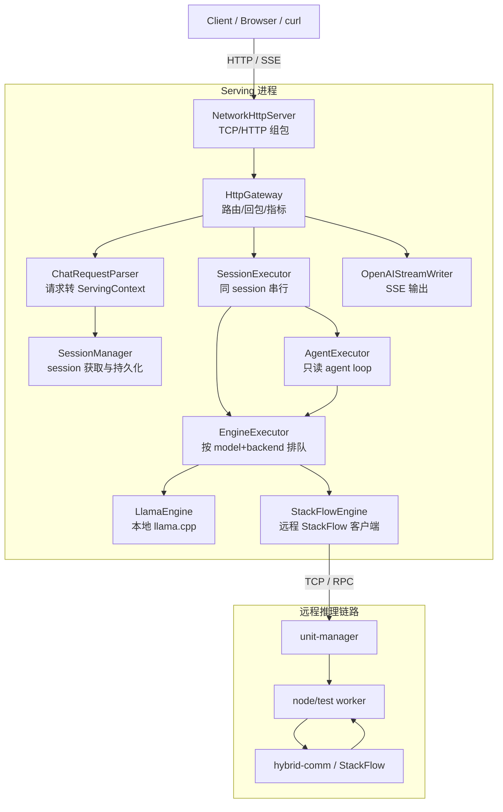

# 系统架构（以当前代码为准）

本文档描述 EdgeLLM-Serving 当前主干代码的真实架构，而不是历史设计目标。重点覆盖 HTTP 接入、session/调度、本地与 RPC 双后端、agent 编排，以及 demo 前端的最新行为。

## 1. 总览

EdgeLLM-Serving 当前是一套统一的 OpenAI 风格 Chat Serving：

- 对外主接口是 `POST /v1/chat/completions`
- 支持非流式 JSON 和流式 SSE
- 支持请求级后端切换
- 支持只读分析型 agent
- 支持可选的 Redis session 持久化

当前系统已经不再是“HTTP 只做 RPC 转发”的结构。实际代码里：

- `serving/http` 负责 HTTP、SSE、请求解析、错误码、模型列表、健康检查
- `serving/core` 负责 session、排队、执行调度、agent 编排
- `engine` 负责本地 `llama.cpp` 或远程 `StackFlow` 执行
- `node/test` 是远程 worker 的 demo 实现

## 2. 主链路

## 3. 当前对外接口

### 3.1 已支持

- `GET /health`
- `GET /metrics`
- `GET /v1/models`
- `POST /v1/chat/completions`
- `POST /v1/chat/completions`（body 带 `"stream": true`）

### 3.2 已废弃或不推荐

- `POST /v1/completions`
  当前会返回 deprecated 错误
- `POST /v1/completions` + `"stream": true`
  当前返回 `501 not_implemented`

## 4. 请求从哪里进来

### 4.1 HTTP 组包

入口文件：

- `serving/http/NetworkHttpServer.cc`

当前实现是连接级 buffer 模型：

- 每个 TCP 连接维护独立字符串缓存
- 先找到 `\r\n\r\n` 解析 header
- 从 header 中读取 `Content-Length`
- 仅在 body 收齐后才进入业务层
- 处理完成后从连接缓存中消费已经解析的部分

这部分解决的是 TCP 分包和粘包，不承担业务逻辑。

### 4.2 路由与回包

核心文件：

- `serving/http/HttpGateway.cc`
- `serving/http/OpenAIStreamWriter.cc`
- `serving/http/HttpStreamSession.cc`

`HttpGateway` 当前实际负责：

- `/health`、`/metrics`、`/v1/models`
- chat 非流式响应
- chat 流式 SSE 输出
- 错误码和 OpenAI 风格错误结构
- 与 `SessionManager`、`SessionExecutor`、`EngineExecutor`、`AgentExecutor` 的衔接

也就是说，当前 `HttpGateway` 不是一个“纯薄转发层”，而是 HTTP 边界和 serving 编排的核心入口。

## 5. Chat 请求如何变成 ServingContext

核心文件：

- `serving/http/ChatRequestParser.cc`

当前解析规则：

- `messages` 必须是数组
- `model` 默认取 `DEFAULT_MODEL`
- `inference_backend` 支持别名规范化
  - `rpc` / `remote` / `worker` / `stackflow` -> `stackflow`
  - `local` / `llama` -> `local`
- `agent=true` 时默认 `agent_mode=code_analysis`
- `max_steps` 上限为 8
- `tools` 作为当前请求的白名单

解析完成后会：

- 创建 `ServingContext`
- 通过 `SessionManager::getOrCreate` 获取 session
- 根据已有 session history 对 `messages` 做前缀 diff

当前 session diff 的真实行为是：

- 如果本次传入消息以前缀方式包含已有历史，只把增量消息送去执行
- 如果不再是前缀关系，则清空旧 history 与旧 model context，当成新会话处理

## 6. 两层排队模型

### 6.1 同 session 串行

核心文件：

- `serving/core/SessionExecutor.cc`

职责：

- 同一个 `session_id` 的请求严格串行执行
- 防止多轮上下文并发污染同一 session
- 队列满时直接拒绝，最终在 HTTP 层表现为 `429` 或错误响应

### 6.2 按 model + backend 排队

核心文件：

- `serving/core/EngineExecutor.cc`

当前 route key 是：

- `ctx->model + "||" + ctx->inference_backend`

所以当前引擎执行队列按“逻辑模型名 + 后端”维度隔离，而不是单纯按模型名。

职责：

- 维护每个 route key 的独立队列
- 超过 `MAX_MODEL_QUEUE` 时拒绝
- 超过 `MAX_QUEUE_WAIT_MS` 时按 overloaded 失败
- 按 route key 复用 `ModelEngine`

## 7. 本地与 RPC 双后端

### 7.1 模型解析与 `/v1/models`

核心文件：

- `engine/ModelRegistry.cc`

当前代码里的关键变化是：

- serving 层支持请求级 `inference_backend` 切换
- 因此 `/v1/models` 会把每个真实模型都标记为同时支持 `local` 和 `rpc`
- 这代表“服务层支持切换”，不代表配置文件里必须为每个模型显式写两份条目

实际解析时：

- `Resolve(model, "local")` 优先构造本地 `llama` 规格
- `Resolve(model, "stackflow")` 优先构造远程 `StackFlow` 规格
- 如果请求 backend 为空，则按模型条目或 `SERVING_BACKEND` 默认选择

### 7.2 本地推理

核心文件：

- `engine/LlamaEngine.cc`

特点：

- 直接加载 GGUF
- 基于 `Session` 复用 KV cache
- 支持 `max_tokens`、`temperature`、`top_p`、`top_k` 等采样参数
- 若生成到上限，返回 `FinishReason::length`

### 7.3 远程 RPC 推理

核心文件：

- `engine/StackFlowEngine.cc`

当前真实协议是：

1. `setup`
2. `inference`
3. `exit`（若未开启 work_id 复用）

关键点：

- 支持 `reuse_work_id`
- 支持复用时串行化保护
- 流式和非流式都能解析 worker 回传的 `finish_reason`
- worker 侧若返回 `length`，HTTP 层现在会正确透传为 OpenAI `finish_reason=length`

## 8. 远程 worker 链路

核心文件：

- `node/test/src/llm_server.cc`
- `node/test/src/llm_task.cc`

当前 worker 的真实行为：

- 启动时通过 `load_model` 加载模型
- 模型路径优先级为：
  - 请求 setup 中显式 `model_path`
  - `config.json` 中 `models[model].model_path`
  - `llama_model_path`
  - 环境变量回退
- 推理输出同时支持流式和非流式
- 回调中携带 `finish_reason`
- 对流式增量做 UTF-8 清洗，避免前端收到截断字符
- `try_begin_infer()` 防止单 worker 并发推理

## 9. Agent 架构

核心文件：

- `serving/core/agent/AgentExecutor.cc`
- `serving/core/agent/AgentPrompt.cc`
- `serving/core/agent/AgentParser.cc`
- `serving/core/agent/BuiltinTools.cc`

当前 agent 的真实定位是：

- 默认模式只有 `code_analysis`
- 是只读分析 agent，不提供写文件、patch 或 shell 能力

当前内置工具共有 6 个：

- `search_code`
- `read_file`
- `list_files`
- `search_docs`
- `get_config`
- `get_server_status`

当前 agent loop 的关键事实：

- 使用 `shadow_session` 保存 agent 内部推理过程
- 最终只把最终答案写回真实 session
- 每个 step 强制最少 `384` token 上限，避免步进回答过短
- 对仓库问题，如果模型没有调工具就想直接回答，会被拉回重新调工具
- `search_code` 的首个命中结果会自动追加一次 `read_file` 上下文
- 解析器会清理 `<think>`、代码块包裹和宽松 JSON 输出

## 10. SSE 与 finish_reason

流式输出链路：

1. `HttpGateway::HandleChatCompletionStream`
2. 创建 `HttpStreamSession`
3. 创建 `OpenAIStreamWriter`
4. engine 通过 `ctx->EmitDelta` 推 chunk
5. `OpenAIStreamWriter` 输出 OpenAI 风格 `data: {...}`
6. 结束时输出 finish chunk 和 `[DONE]`

当前 finish_reason 语义：

- `stop`
- `length`
- `cancelled`
- `error`

最近代码已经修正：

- RPC / worker 链路的 `finish_reason` 会一直透传到前端
- demo 前端会显示 finish reason
- 若 finish reason 是 `length`，前端会自动尝试续写

## 11. Demo 前端

核心文件：

- `demo/web/index.html`
- `scripts/start_agent_demo.sh`

当前 demo 页面支持：

- `Base URL`
- `Model`
- `Inference Backend`
- `Stream / Non-stream`
- `Enable Agent`
- agent preset
- 右侧固定高度、内部滚动的响应窗口
- `Finish`、`TTFB`、`Duration`
- 截断后自动续写

当前前端默认只请求 `/v1/chat/completions`，不会再推荐旧 `/v1/completions`。

## 12. 关键配置

主要来自根目录 `config.json`：

- `default_model`
- `models`
- `default_max_tokens`
- `serving_backend`
- `stackflow_host`
- `stackflow_port`
- `stackflow_unit`
- `stackflow_timeout_ms`
- `stackflow_infer_timeout_ms`
- `stackflow_reuse_work_id`
- `stackflow_serialize_reuse`
- `stackflow_max_concurrency`
- `session_persist_redis`

当前默认配置里：

- 默认模型是 `qwen3.5-2b`
- 默认 `default_max_tokens` 是 `512`
- `stackflow_timeout_ms` 和 `stackflow_infer_timeout_ms` 都是 `180000`

## 13. 当前最值得记住的设计点

如果只记 6 件事，记下面这些：

1. HTTP 层不是薄代理，真实负责请求解析、session 串行、SSE 回写和错误映射。
2. 请求先按 session 串行，再按 model+backend 排队。
3. `/v1/models` 同时暴露模型级 `backends`（配置能力）和路由级 `gateway_backends`（请求级切换能力）。
4. agent 当前是只读的 `code_analysis` agent，不是通用自治 agent。
5. RPC / worker 链路现在已经透传真实 `finish_reason`。
6. demo 前端已经有固定响应窗、finish reason 展示和自动续写逻辑。
