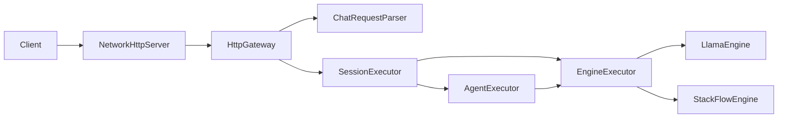

# HTTP Gateway 使用说明（当前实现）

本文档只描述当前 `serving/http` 目录对应的真实实现，不再沿用早期“HTTP 只做 StackFlow 转发”的旧边界定义。

## 1. 当前模块职责

`serving/http` 现在承担的是完整的 HTTP 接入层职责：

- TCP 连接级 HTTP 组包
- OpenAI 风格请求解析与错误码映射
- `/health`、`/metrics`、`/v1/models`
- `POST /v1/chat/completions`
- 流式 SSE 输出
- 与 `SessionManager`、`SessionExecutor`、`EngineExecutor`、`AgentExecutor` 衔接

它不直接做模型推理，但它已经不是“只把 HTTP 包翻成 StackFlow RPC”的薄适配层。

## 2. 目录与文件

当前主要文件：

- `serving/http/NetworkHttpServer.cc`
- `serving/http/NetworkHttpTypes.h`
- `serving/http/HttpGateway.cc`
- `serving/http/ChatRequestParser.cc`
- `serving/http/OpenAIStreamWriter.cc`
- `serving/http/HttpStreamSession.cc`
- `serving/http/http_main.cc`

## 3. 当前支持的接口

### 3.1 正式接口

- `GET /health`
- `GET /metrics`
- `GET /v1/models`
- `POST /v1/chat/completions`
- `POST /v1/chat/completions?stream=true`

### 3.2 已废弃接口

- `POST /v1/completions`
  返回 deprecated 错误
- `POST /v1/completions?stream=true`
  返回 `501 not_implemented`

## 4. 架构位置



如果是流式请求，`HttpGateway` 还会创建：

- `HttpStreamSession`
- `OpenAIStreamWriter`

## 5. HTTP 组包模型

核心文件：

- `serving/http/NetworkHttpServer.cc`

当前实现要点：

- 每个连接维护独立缓存 `http_buffers_[conn]`
- `onMessage()` 只负责把新字节追加到缓存
- `handleHttpRequest()` 查找 `\r\n\r\n`
- 解析 `Content-Length`
- body 没收齐时直接返回等待下一波 TCP 数据
- 收齐后构造 `HttpRequest` 并消费已处理缓存

这部分是当前 HTTP 稳定性的基础，负责解决 TCP 分包和粘包。

## 6. 路由与请求解析

### 6.1 路由

当前 `NetworkHttpServer` 做的路由分发包括：

- `OPTIONS` CORS 预检
- `GET /health`
- `GET /metrics`
- `GET /v1/models`
- `POST /v1/completions`
- `POST /v1/chat/completions`

其中 `stream=true` 通过 query 识别。

### 6.2 Chat 请求解析

核心文件：

- `serving/http/ChatRequestParser.cc`

当前会解析：

- `model`
- `messages`
- `session_id`
- `max_tokens`
- `inference_backend`
- `agent`
- `agent_mode`
- `max_steps`
- `tools`
- 各类采样参数

解析结果统一进入 `ServingContext`。

## 7. HttpGateway 当前真实职责

核心文件：

- `serving/http/HttpGateway.cc`

当前真实职责如下。

### 7.1 初始化服务内对象

`HttpGateway` 构造函数里会初始化：

- `ThreadPool`
- `EngineExecutor`
- `SessionExecutor`
- `SessionManager`
- `AgentExecutor`

并为 agent 注入一个 `status_provider`，让 `get_server_status` 可以返回服务当前指标。

### 7.2 非流式路径

`HandleChatCompletion()` 当前流程：

1. 解析请求体
2. 构造 `ServingContext`
3. 记录请求日志
4. 通过 `SessionExecutor` 提交任务
5. 若 `agent=true`，执行 `AgentExecutor::Run`
6. 否则执行 `EngineExecutor::Execute`
7. `WaitFinishOrCancel()` 等待完成或连接断开
8. 根据 `finish_reason` 与 `error_message` 返回 JSON 或错误

### 7.3 流式路径

`HandleChatCompletionStream()` 当前流程：

1. 解析请求体
2. 创建 `HttpStreamSession`
3. 创建 `OpenAIStreamWriter`
4. 把 `ctx->on_chunk` 绑定到 writer
5. 通过 `SessionExecutor` 提交执行任务
6. engine 通过 `ctx->EmitDelta` 输出 chunk
7. 完成时输出 finish chunk 和 `[DONE]`

### 7.4 Session 更新策略

当前只在以下情况把 assistant 回答写回 session：

- `stop`
- `length`

对于：

- `cancelled`
- `error`

不会污染会话历史。

## 8. `/v1/models` 的当前语义

`GET /v1/models` 基于 `ModelRegistry::ListModelInfos()` 生成。

当前代码里：

- 每个真实模型默认都宣称支持 `local`
- 同时也宣称支持 `rpc`

原因不是配置文件里一定显式写了两份模型，而是 serving 层已经支持请求级 `inference_backend` 切换。

因此 `/v1/models` 的 `backends` 更像“网关支持的调用方式”，而不是单纯的静态配置镜像。

## 9. 错误处理与状态码

当前常见状态码：

- `200` 正常
- `204` CORS 预检
- `400` 参数错误、废弃接口、非法请求
- `404` 路由不存在
- `405` 方法不允许
- `429` session queue 或 model queue 过载
- `500` 内部错误
- `501` 不支持的接口模式

错误体统一使用 OpenAI 风格：

```json
{
  "error": {
    "message": "...",
    "type": "...",
    "code": "..."
  }
}
```

## 10. finish_reason 与 SSE

当前 `serving/http` 已经可以正确透传以下 finish reason：

- `stop`
- `length`
- `cancelled`
- `error`

配套文件：

- `serving/http/OpenAIStreamWriter.cc`
- `serving/core/ServingContext.h`

最近修复后的行为：

- RPC / worker 链路若生成长度触顶，会回到 `length`
- SSE 结束 chunk 会携带正确 `finish_reason`

## 11. 健康检查与指标

### 11.1 `/health`

返回：

- `status`
- `uptime_ms`

### 11.2 `/metrics`

返回：

- `requests_total`
- `requests_in_flight`
- `requests_stream_total`
- `requests_error_total`
- `requests_cancelled_total`
- `avg_latency_ms`

agent 的 `get_server_status` 也会复用同一批内部计数器。

## 12. 配置项

HTTP 层直接或间接依赖的主要配置：

- `HTTP_PORT`
- `WORKER_THREADS`
- `DEFAULT_MODEL`
- `DEFAULT_MAX_TOKENS`
- `MAX_MODEL_QUEUE`
- `MAX_SESSION_PENDING`
- `MAX_QUEUE_WAIT_MS`
- `CONFIG_PATH`

此外，底层 engine 还会继续读取：

- `LLAMA_*`
- `STACKFLOW_*`
- Redis session 持久化相关配置

这些通常来自根目录 `config.json`，由 `http_main.cc` 读取并写入环境变量。

## 13. 当前 demo 与 HTTP 层的关系

demo 页面在：

- `demo/web/index.html`

启动脚本：

- `scripts/start_agent_demo.sh`

它当前默认调用：

- `/v1/chat/completions`
- `/v1/chat/completions?stream=true`

前端已经支持：

- `Finish` 展示
- 自动续写 `length` 截断
- 固定高度滚动响应面板

这些都是建立在当前 HTTP 层已经正确返回 `finish_reason` 的基础上。

## 14. 最后一句话

当前 `serving/http` 的正确定位是：

> 一个完整的 OpenAI 风格 HTTP/SSE 接入层，负责协议边界、请求解析、错误映射、session 编排入口和流式输出，而不是早期定义里的单纯 RPC 转发壳。
